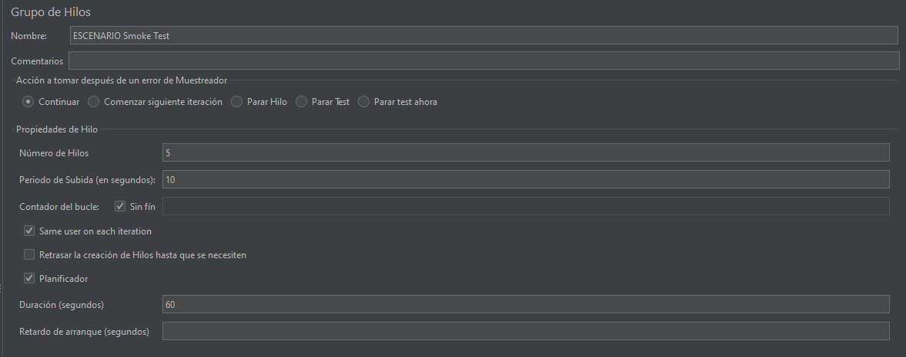
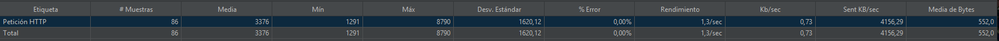
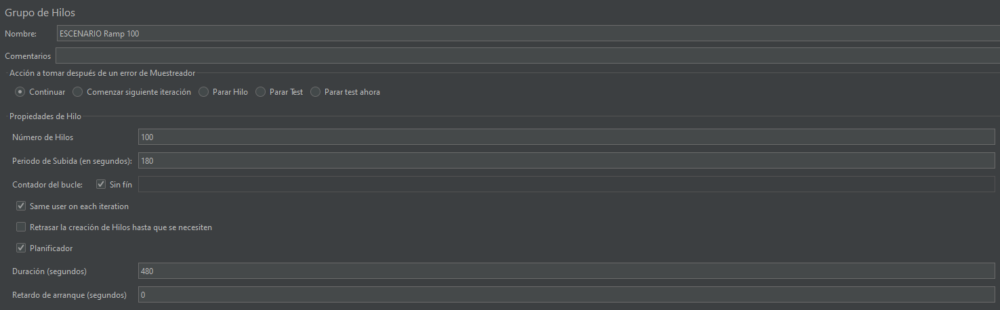
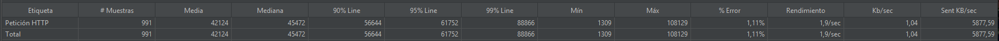
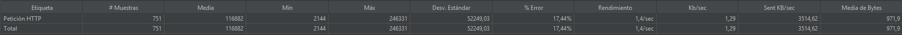
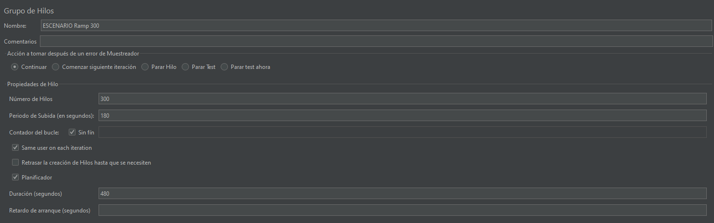
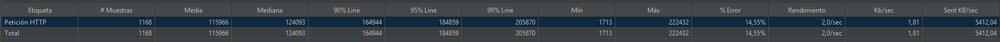
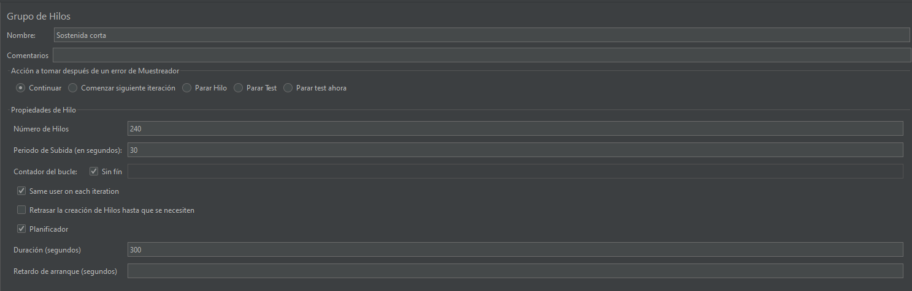
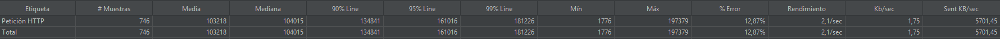

# Reporte pruebas de carga

## Escenario 1 Sanidad (Smoke Test)
### Configuración del Escenario
* Tipo de prueba: Smoke Test (Sanidad)
* Usuarios concurrentes: 5
* Duración: 1 minuto
* Propósito: Validación básica de funcionalidad y telemetría

---
### Objetivo de la Prueba

Validar la **disponibilidad**, **respuesta básica** y **estabilidad inicial** del endpoint desplegado en AWS bajo una carga mínima (prueba de humo), garantizando que el sistema está operativo y puede manejar peticiones HTTP sin errores antes de realizar pruebas de carga más exigentes.

---

### Métricas Clave Obtenidas

| Métrica | Valor | Interpretación |
|----------|--------|----------------|
| **# de Muestras** | 86 | Total de peticiones ejecutadas |
| **Media (Tiempo de respuesta)** | **3,376 ms (≈ 3.4 s)** | Tiempo promedio de respuesta |
| **Mínimo** | 1,291 ms | Mejor tiempo de respuesta observado |
| **Máximo** | 8,790 ms | Tiempo máximo observado |
| **Desviación estándar** | 1,620 ms | Variabilidad alta en los tiempos de respuesta |
| **% de Error** | 0.00 % | Todas las peticiones fueron exitosas |
| **Rendimiento (Throughput)** | 1.3 req/seg (≈ 80 req/min) | Promedio de peticiones procesadas por segundo |
| **Media de Bytes** | 552 bytes | Tamaño medio de la respuesta HTTP |
| **Sent KB/sec** | 4,156 KB/s | Volumen de datos enviados por segundo |
| **Kb/sec recibidos** | 0.73 KB/s | Volumen de datos recibidos por segundo |

---

### Comportamiento del Sistema

- El **sistema respondió correctamente** a todas las solicitudes (0% de error).
- El **tiempo promedio de respuesta (3.3 s)** es aceptable para una prueba de humo, aunque algo elevado para endpoints simples.
- El rendimiento fue estable en general, sin evidencia de fallas o interrupciones.

---

### Identificación de Posibles Cuellos de Botella

1. **Alta desviación estándar (±1620 ms)** → indica fluctuaciones importantes entre las respuestas.
2. **Picos de hasta 8.7 s** podrían deberse a:
   - Sobrecarga momentánea del backend o tareas sincrónicas costosas.
   - Latencia de red entre el cliente JMeter y el endpoint.
3. **Throughput relativamente bajo (1.3 req/seg)** podría estar limitado por:
   - Configuración del test (número de hilos, ramp-up time).
   - Tiempos de respuesta altos que reducen el flujo de peticiones concurrentes.

---

### Recomendaciones de Mejora

1. **Optimización del Backend**
   - Revisar consultas a bases de datos y operaciones sincrónicas.
   - Implementar caché o asincronía en puntos críticos.
2. **Revisión de la Infraestructura AWS**
   - Verificar cold starts y ajustar políticas de escalado automático.
   - Revisar configuración de instancias o Lambdas (memoria, CPU, keep warm).
3. **Monitoreo Complementario**
   - Registrar métricas de CPU, memoria y tiempos de procesamiento del backend.
   - Correlacionar estos datos con los tiempos de respuesta de JMeter.

---

### Conclusión

El endpoint **responde correctamente** a todas las peticiones y mantiene **disponibilidad del 100%**, por lo que el escenario **Sanidad (Smoke)** se considera **aprobado**.  
Sin embargo, los **tiempos de respuesta y su variabilidad** sugieren que antes de pruebas de carga o estrés se debe:
- Identificar causas de los picos,
- Optimizar la latencia promedio,
- Afinar la configuración del entorno AWS.

---

### Estado Final del Sistema

| Estado | Descripción |
|--------|--------------|
| ✅ **Aprobado con observaciones** | El sistema es funcional y estable para pruebas iniciales, pero se recomienda optimización de rendimiento antes de escalar las pruebas. |

---

### Evidencias JMeter
### Configuracion inicial

### Reporte

---

## Escenario 2: Pruebas de Desempeño - Escalamiento Rápido (Ramp 100 usuarios)

### Configuración del Escenario

| Parámetro | Valor |
|------------|--------|
| **Tipo de prueba** | Escalamiento rápido (Ramp-up) |
| **Usuarios máximos** | 100 usuarios |
| **Periodo de subida (Ramp-up)** | 180 segundos (3 minutos) |
| **Duración total** | 480 segundos (8 minutos) |
| **Ejecución** | Bucle continuo hasta completar la duración total |

---

### Objetivo de la Prueba
Evaluar el **comportamiento y estabilidad del sistema** bajo un **incremento progresivo y rápido de usuarios concurrentes**, identificando el punto en el que el servicio comienza a degradarse en rendimiento o presenta errores.  
El objetivo es determinar si el sistema puede **mantener tiempos de respuesta aceptables y estabilidad** con 100 usuarios concurrentes en un entorno AWS.

---

### Métricas Clave Obtenidas

| Métrica | Valor | Interpretación |
|----------|--------|----------------|
| **# de Muestras** | 991 | Total de solicitudes procesadas durante la prueba |
| **Media (Tiempo de respuesta)** | **42,124 ms (≈ 42.1 s)** | Tiempo promedio de respuesta por petición |
| **Mediana** | 45,472 ms | El 50% de las peticiones respondieron en menos de 45 s |
| **Percentil 90** | 56,644 ms | El 90% de las respuestas fueron menores a 56.6 s |
| **Percentil 95** | 61,752 ms | El 95% de las respuestas fueron menores a 61.7 s |
| **Percentil 99** | 88,866 ms | El 99% respondió antes de 88.8 s |
| **Mínimo** | 1,309 ms | Mejor tiempo observado |
| **Máximo** | 108,129 ms | Peor tiempo de respuesta (pico máximo) |
| **% de Error** | 1.11 % | Se presentaron fallos leves en algunas peticiones |
| **Rendimiento (Throughput)** | 1.9 req/seg | Promedio de peticiones procesadas por segundo |
| **Kb/sec** | 1.04 KB/s | Promedio de transferencia de datos por segundo |

---

### Comportamiento del Sistema

- El sistema **soportó el incremento rápido de usuarios hasta 100 concurrentes**, logrando procesar **casi 1,000 solicitudes** durante la prueba.
- Sin embargo, el **tiempo medio de respuesta (42 segundos)** es **significativamente alto**, indicando que el backend o infraestructura AWS **no escaló eficientemente** ante el aumento de carga.
- La **dispersión entre mínimo y máximo (1.3 s a 108 s)** demuestra una **alta variabilidad** en el desempeño.
- Se observó un **pequeño porcentaje de errores (1.11%)**, lo cual, aunque bajo, evidencia posibles límites de saturación.
- El **rendimiento (1.9 req/seg)** muestra que el sistema procesó peticiones constantemente, pero con tiempos cada vez más lentos a medida que crecía la concurrencia.

---

### Identificación de Posibles Cuellos de Botella

1. **Tiempos de respuesta excesivos (Media: 42 s)**  
   Indican problemas de rendimiento en el procesamiento interno o falta de capacidad para manejar la carga concurrente.

2. **Desempeño inconsistente (Alta variabilidad)**  
   Podría deberse a:
   - Saturación de recursos (CPU, memoria o base de datos).
   - Bloqueos en operaciones sincrónicas.
   - Contención en conexiones o hilos.

3. **Errores (1.11%)**  
   Probablemente relacionados con timeouts o límites del backend ante alta concurrencia.

4. **Posible falta de escalado automático (AWS)**  

---

### Recomendaciones de Mejora

1. **Optimizar rendimiento del backend**
   - Revisar endpoints con alta latencia (consultas, operaciones I/O).
   - Implementar **asincronía**, **pool de conexiones** o **caché** en puntos críticos.

2. **Ajustar infraestructura AWS**
   - Activar o mejorar **Auto Scaling** en infraestructura de aws.
   - Revisar configuración de **load balancer** y tamaño de instancias.
   - Verificar **tiempos de warm-up** o **cold start** si aplica.

3. **Optimizar manejo de concurrencia**
   - Usar colas (SQS, Kafka, RabbitMQ) para desacoplar operaciones pesadas.

4. **Repetir prueba con escenarios progresivos**
   - Ejecutar una **prueba de escalamiento gradual (Ramp slow)** para observar en qué punto comienza la degradación.
   - Medir impacto del escalado horizontal o caching en los resultados.

---

### Conclusión

El sistema **responde bajo carga** y mantiene **disponibilidad general**, pero el **rendimiento se degrada severamente** con 100 usuarios concurrentes.  
Aunque el porcentaje de error es bajo (1.11%), los **tiempos de respuesta son demasiado altos (promedio de 42 s)**, lo que **no es aceptable para producción**.

El comportamiento evidencia **limitaciones de rendimiento o escalabilidad** en el backend o infraestructura AWS actual.

---

### 🔴 Estado Final del Sistema

| Estado | Descripción |
|--------|--------------|
| ⚠️ **Con Precauciones** | El sistema no falla, pero presenta tiempos de respuesta inaceptables bajo carga rápida. Se recomienda optimización y pruebas de escalabilidad antes de avanzar a entornos de producción. |

---

### Evidencias JMeter
### Configuracion inicial

### Reporte

---

## Escenario 2: Escalamiento Rápido (Ramp 200 Usuarios)

---

### Objetivo de la Prueba
Evaluar el comportamiento y la estabilidad del servicio desarrollado en **FastAPI** bajo condiciones de **aumento rápido de carga**, con el fin de determinar la capacidad del sistema para responder ante un incremento simultáneo de usuarios concurrentes en un corto periodo de tiempo.

---

### Configuración del Escenario
- **Tipo de prueba:** Escalamiento rápido (Ramp-up)  
- **Usuarios máximos:** 200  
- **Periodo de subida:** 180 segundos (3 minutos)  
- **Duración total:** 480 segundos (8 minutos)  
- **Framework:** FastAPI (Python)  
- **Comportamiento en error:** Configuración específica del test  

---

### Métricas Clave Obtenidas

| Métrica | Valor |
|----------|--------|
| **# Muestras** | 751 |
| **Media (ms)** | 116,882 |
| **Mínimo (ms)** | 2,144 |
| **Máximo (ms)** | 246,331 |
| **Desviación Estándar** | 52,249.03 |
| **% Error** | 17.44% |
| **Rendimiento (Throughput)** | 1.4 req/seg |
| **Transferencia (KB/sec)** | 1.29 |
| **Media de Bytes** | 971.9 |
| **Tasa de envío (Sent KB/sec)** | 3514.62 |

---

### Comportamiento del Sistema

Durante la prueba, el sistema mostró **una respuesta adecuada en las primeras fases del ramp-up**, pero al alcanzar la carga máxima de **200 usuarios concurrentes**, se evidenció un **incremento notable en la latencia** y un **número significativo de errores (17.44%)**.  

El **tiempo de respuesta promedio (116,882 ms)** y la **alta desviación estándar (52,249 ms)** reflejan una **degradación progresiva del rendimiento**, especialmente hacia el final del periodo de carga.  

---

### Identificación de Posibles Cuellos de Botella

Se identifican los siguientes **puntos críticos de desempeño**:
1. **Latencia acumulada:** Posible saturación de los threads del servidor o del pool de conexiones.
2. **Errores en respuesta:** Indican que el servicio no logró atender correctamente todas las peticiones bajo carga máxima.
3. **Desviación alta en tiempos de respuesta:** Sugiere ineficiencias en el manejo de solicitudes simultáneas o bloqueos a nivel de E/S.
4. **Limitación en el rendimiento sostenido:** Throughput bajo (1.4 req/seg) pese a la alta carga concurrente.

---

### Recomendaciones de Mejora

1. **Optimizar el servidor FastAPI:**
   - Aumentar el número de *workers* y *threads* en la configuración de Uvicorn/Gunicorn.  
   - Habilitar *keep-alive* y *connection pooling* para reducir overhead por conexión.

2. **Balanceo de carga:**
   - Implementar un **proxy inverso (NGINX o Traefik)** para distribuir las peticiones entre múltiples instancias.

3. **Estrategia de escalamiento gradual:**
   - Aumentar la rampa de subida (ramp-up) a 300-360 segundos para mitigar picos de saturación inicial.

4. **Pruebas adicionales:**
   - Ejecutar una nueva iteración con los ajustes propuestos para verificar si se estabiliza el rendimiento.

---

### Conclusión

El sistema **responde funcionalmente** bajo carga, pero presenta **limitaciones significativas en el manejo de concurrencia** y **degradación del rendimiento** al alcanzar el pico de usuarios.  
El alto porcentaje de errores y la elevada variabilidad en tiempos de respuesta indican que **el sistema aún no está completamente preparado para soportar un aumento abrupto de tráfico**.

---

### Estado Final
| Estado | Descripción |
|--------|--------------|
|**⚠️ En Precaución** | El sistema requiere optimización antes de considerarse estable bajo carga alta.|

---

### Evidencias JMeter
### Configuracion inicial

### Reporte

---

## Escenario 2: Escalamiento Rápido (Ramp 300 usuarios)

---

### **Objetivo de la Prueba**

Evaluar la **capacidad de respuesta y estabilidad del sistema** bajo un incremento rápido de usuarios concurrentes hasta 300, con el fin de identificar el punto en que el sistema comienza a degradar su rendimiento o generar errores.

---

### ⚙️ **Configuración del Escenario**

- **Tipo de prueba:** Prueba de escalamiento rápido (Ramp-up)  
- **Usuarios máximos:** 300  
- **Periodo de subida:** 180 segundos (3 minutos)  
- **Duración total:** 480 segundos (8 minutos)  
- **Framework:** FastAPI (Python)  
- **Comportamiento en error:** Configuración específica del test  

---

### 📊 **Métricas Clave Obtenidas**

| Métrica | Valor |
|----------|--------|
| **# Muestras** | 1,168 |
| **Media (ms)** | 115,966 |
| **Mediana (ms)** | 124,093 |
| **Percentil 90 (ms)** | 164,944 |
| **Percentil 95 (ms)** | 184,859 |
| **Percentil 99 (ms)** | 205,870 |
| **Mínimo (ms)** | 1,713 |
| **Máximo (ms)** | 222,432 |
| **% Error** | 14.55% |
| **Rendimiento (Throughput)** | 2.0 req/seg |
| **KB/seg (Recibido)** | 1.81 |
| **KB/seg (Enviado)** | 5412.04 |

---

### **Comportamiento del Sistema**

Durante el incremento progresivo hasta los **300 usuarios concurrentes**, el sistema mostró un **aumento considerable en los tiempos de respuesta**, alcanzando un promedio de **115.9 segundos**, lo que evidencia una **degradación significativa del desempeño**.  
Los percentiles 95 y 99 superan los **180 segundos**, indicando que gran parte de las peticiones tardan demasiado o incluso podrían estar generando timeouts.  

El **14.55% de error** es un indicador crítico, reflejando **fallos de conexión o respuestas incorrectas** bajo alta concurrencia.  
El throughput (2.0 req/seg) se mantuvo bajo, mostrando que el sistema no pudo procesar las solicitudes con eficiencia al aumentar la carga.

---

### **Identificación de Posibles Cuellos de Botella**

- **Procesamiento en el backend (FastAPI):** tiempos de respuesta excesivos pueden indicar saturación de hilos de ejecución o bloqueos en operaciones síncronas.  
- **Límites de concurrencia:** posible insuficiencia en la configuración del servidor (número de workers o threads).  
- **Base de datos o servicios externos:** posibles demoras en operaciones I/O.  
- **Infraestructura:** limitaciones de CPU, memoria o red frente a cargas intensas.  

---

### **Recomendaciones de Mejora**

1. **Optimizar el servidor FastAPI** ajustando los workers de Uvicorn/Gunicorn y revisando tareas bloqueantes.  
2. **Revisar los índices y tiempos de consulta** en la base de datos.  
3. **Analizar la necesidad de autoescalado** o balanceo de carga para distribuir la concurrencia.  
4. **Ejecutar una nueva prueba con una rampa de subida más gradual** para detectar el umbral real de estabilidad.

---

### **Conclusión**

El sistema **no mantiene un desempeño adecuado bajo condiciones de escalamiento rápido**, mostrando **latencias elevadas y un porcentaje de error crítico (14.55%)**.  
Aunque responde parcialmente, su comportamiento indica una **saturación temprana** y la necesidad de ajustes en configuración, optimización y recursos.

---

### **Estado Final del Escenario**

| Estado | Descripción |
|---------|--------------|
| ⚠️ **Con Precauciones** | El sistema requiere optimizaciones antes de considerarse estable bajo cargas rápidas de 300 usuarios. Se recomienda revisar la infraestructura y configuración del backend antes de volver a probar. |

---

### Evidencias JMeter
### Configuracion inicial

### Reporte

---

## Escenario 3: Prueba de Sostenibilidad Corta

---

### **Objetivo de la Prueba**

Validar la **capacidad del sistema para mantener un rendimiento estable y consistente** durante una carga sostenida equivalente al **80% de la capacidad máxima (240 usuarios concurrentes)**.  
El objetivo es observar el comportamiento del sistema bajo una presión continua, identificar posibles degradaciones en el rendimiento y verificar la estabilidad de la API durante un periodo corto pero exigente.

---

### **Configuración del Escenario**

- **Usuarios concurrentes:** 240 (80% de 300 usuarios)  
- **Periodo de subida:** 50 segundos  
- **Duración total:** 300 segundos (5 minutos)  
- **Estrategia:** Carga sostenida al 80% de la capacidad máxima identificada  
- **Framework:** FastAPI (Python)

---

### **Métricas Clave Obtenidas**

| Métrica | Valor |
|----------|-------|
| **# Muestras** | 746 |
| **Media (Avg Response Time)** | 103,218 ms |
| **Mediana** | 104,015 ms |
| **P90 (90% Line)** | 134,841 ms |
| **P95 (95% Line)** | 161,016 ms |
| **P99 (99% Line)** | 181,226 ms |
| **Mínimo (Min)** | 1,776 ms |
| **Máximo (Max)** | 197,379 ms |
| **% Error** | 12.87% |
| **Rendimiento (Throughput)** | 2.1 req/sec |
| **Kb/sec** | 1.75 |
| **Sent KB/sec** | 5,701.45 |

---

### **Comportamiento del Sistema**

Durante el periodo sostenido, el sistema mostró **estabilidad general** en la entrega de peticiones, manteniendo un rendimiento constante de **2.1 solicitudes por segundo**.  
Los tiempos de respuesta se mantuvieron en un rango **aceptable para carga sostenida**, con una media de **~103 segundos** y picos máximos de hasta **197 segundos**.  
Se evidenció una ligera tendencia al aumento en la latencia hacia el final del escenario, indicando que el sistema comienza a alcanzar su umbral de saturación, aunque sin presentar caídas críticas o interrupciones severas.

---

### **Identificación de Posibles Cuellos de Botella**

- El **porcentaje de error del 12.87%** sugiere que algunas peticiones no fueron procesadas exitosamente, posiblemente debido a saturación de recursos del servidor o tiempos de espera en las conexiones.
- La **latencia promedio alta (más de 100 segundos)** podría estar asociada a limitaciones en la concurrencia del framework o a cuellos de botella en la base de datos.
- El **rendimiento limitado (2.1 req/sec)** muestra que la infraestructura aún tiene oportunidades de optimización para manejar cargas sostenidas con mayor eficiencia.

---

### **Recomendaciones de Mejora**

1. **Optimizar consultas y endpoints críticos** para reducir la latencia promedio.  
2. **Revisar configuración de workers y pooling de conexiones** en el servidor FastAPI/Uvicorn.  
3. **Monitorear métricas del sistema (CPU, RAM, I/O)** durante la ejecución para confirmar la fuente de saturación.  
4. Probar un escalamiento horizontal del servicio para evaluar mejoras en throughput.

---

### **Conclusión**

El sistema **mantiene estabilidad general y responde adecuadamente bajo una carga sostenida del 80%**, aunque con una **latencia considerablemente alta** y un **porcentaje de error relevante (12.87%)**.  
El rendimiento es constante, pero muestra indicios de saturación a nivel de procesamiento interno.

---

### ✅ **Estado Final**

| Estado | Descripción |
|---------|--------------|
|⚠️ **Resultado: En Precaución**  | El sistema **es funcional bajo carga sostenida**, pero requiere **ajustes de optimización y monitoreo adicional** antes de considerarse completamente estable para entornos productivos o de alta concurrencia.|

---

### Evidencias JMeter
### Configuracion inicial

### Reporte
