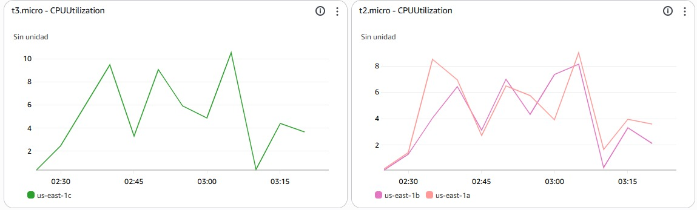
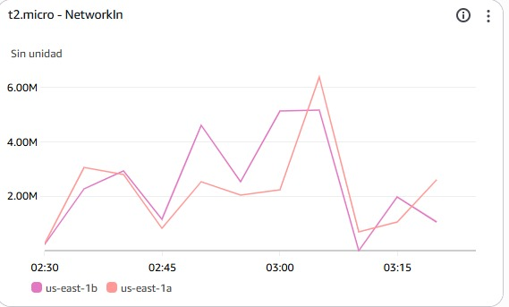

# API
## RANKING
- **Metodo:** GET
- **Host:** labelb-2039041540.us-east-1.elb.amazonaws.com 
- **Api:** /api/videos 
- **URL** http://labelb-2039041540.us-east-1.elb.amazonaws.com/api/videos 

---

# ESCENARIO 1 (AWS,BALANCEADOR,AUTOSCALING) CAPACIDAD DE LA CAPA WEB 

# 🧪 Informe de Pruebas Smoke Test

## ⚙️ Configuración de la Prueba
- **Herramienta:** Apache JMeter  
- **Número de Hilos:** 5  
- **Periodo de Subida:** 10 segundos  
- **Contador de Bucle:** Sin fin  
- **Duración Total:** 60 segundos  
- **Infraestructura:** AWS (Balanceador de carga + AutoScaling + S3)  

---

## 🧮 1. Métricas Clave Obtenidas

| Métrica | Valor |
|----------|--------|
| **# Muestras (Requests)** | 2407 |
| **Tiempo Medio de Respuesta (Media)** | 115 ms |
| **Mediana (50%)** | 118 ms |
| **90 Percentil** | 139 ms |
| **95 Percentil** | 144 ms |
| **99 Percentil** | 161 ms |
| **Tiempo Mínimo** | 81 ms |
| **Tiempo Máximo** | 428 ms |
| **% de Error** | 50.02% |
| **Rendimiento (Throughput)** | 40.1 req/seg |
| **KB Recibidos/seg** | 21.84 |
| **KB Enviados/seg** | 11.74 |

---

## 📊 2. Comportamiento del Sistema

- El **tiempo medio de respuesta (115 ms)** indica un **buen desempeño individual de las peticiones exitosas**.  
- Los percentiles (90, 95 y 99) están por debajo de 200 ms, mostrando **consistencia en las respuestas exitosas**.  
- Sin embargo, el **50.02% de errores** representa un **problema crítico de estabilidad o disponibilidad**, afectando significativamente el rendimiento global.  
- Esto sugiere que el sistema puede estar experimentando fallos en el balanceador, la capa de aplicación o las dependencias externas (por ejemplo, S3).

---

## 🚨 3. Identificación de Posibles Cuellos de Botella

1. **Balanceador de Carga (ELB/ALB):**  
   - Posible configuración inadecuada de distribución o timeouts.  
   - Health checks agresivos podrían causar desconexiones prematuras.

2. **Instancias de Aplicación / AutoScaling:**  
   - El escalamiento automático podría estar reaccionando lentamente ante la carga.  
   - Revisar métricas de **CPU, memoria y network I/O** en CloudWatch.

3. **Dependencias Externas (S3 / Servicios Internos):**  
   - Posible lentitud o errores en solicitudes hacia S3 u otros servicios backend.

4. **Log de error:**  
   - En la herramienta JMete vemos que en los logs que el error que arroja es 503

---

## 🔧 4. Recomendaciones de Mejora
 
1. **Revisar métricas de AWS CloudWatch:**  
   - `ELB 5XXErrorRate`, `TargetResponseTime`, `CPUUtilization`, `RequestCount`.  
2. **Ajustar políticas de AutoScaling** para reducir el tiempo de reacción ante picos de carga.  
3. **Optimizar configuración del balanceador de carga:**  
   - Ajustar `idle timeout`, `connection draining` y `health check thresholds`.  
4. **Ejecutar pruebas adicionales controladas:**  
   - Disminuir número de hilos o duración para comparar tasas de error.  
5. **Monitorear los logs del backend** para identificar excepciones o cuellos de conexión.

---

## 🧩 5. Conclusión

El endpoint presenta **buen rendimiento en las peticiones exitosas (115 ms promedio)**, pero muestra **un alto nivel de errores (50%)**, lo que compromete su estabilidad.  
Esto indica que el sistema **no mantiene un comportamiento consistente bajo carga sostenida**, afectando su confiabilidad.

---

## 🟡 6. Estado Final del Sistema

**Estado:** ⚠️ *Con Precauciones*  

> Aunque las respuestas exitosas son rápidas, la alta tasa de error impide aprobar la prueba.  
> Se recomienda **ajustar la configuración de infraestructura (AutoScaling, Balanceador y dependencias)** antes de considerar este endpoint como estable para producción.

---

# 🧪 Informe de Pruebas Ramp 100

## ⚙️ Configuración de la Prueba
- **Herramienta:** Apache JMeter  
- **Número de Hilos:** 100  
- **Periodo de Subida:** 180 segundos  
- **Contador de Bucle:** Sin fin  
- **Duración Total:** 480 segundos  
- **Infraestructura:** AWS (Balanceador de Carga + AutoScaling + S3)  

---

## 🧮 1. Métricas Clave Obtenidas

| Métrica | Valor |
|----------|--------|
| **# Muestras (Requests)** | 339418 |
| **Tiempo Medio de Respuesta (Media)** | 114 ms |
| **Mediana (50%)** | 101 ms |
| **90 Percentil** | 118 ms |
| **95 Percentil** | 130 ms |
| **99 Percentil** | 194 ms |
| **Tiempo Mínimo** | 80 ms |
| **Tiempo Máximo** | 28,474 ms |
| **% de Error** | 96.01% |
| **Rendimiento (Throughput)** | 693.4 req/seg |
| **KB Recibidos/seg** | 431.87 |
| **KB Enviados/seg** | 203.14 |

---

## 📊 2. Comportamiento del Sistema

- El sistema procesó un alto volumen de solicitudes (**más de 339000 requests**) en 8 minutos, con un **throughput de 693 req/seg**, lo cual refleja buena capacidad de envío desde el cliente.  
- Sin embargo, el **96% de las solicitudes fallaron** con error **HTTP 503 (Service Unavailable)**, lo que indica que el servicio no logró atender la carga solicitada.  
- El **tiempo medio de respuesta (114 ms)** de las pocas peticiones exitosas es bajo, señal de que cuando el sistema logra responder, lo hace con rapidez.  
- Los percentiles 90, 95 y 99 se mantienen en rangos bajos (≤ 200 ms), lo que refuerza la idea de que **el cuello de botella no está en el tiempo de respuesta, sino en la disponibilidad del servicio bajo carga**.

---

## 🚨 3. Identificación de Posibles Cuellos de Botella

1. **Balanceador de Carga (ELB/ALB):**  
   - Los errores 503 generalmente provienen del balanceador cuando **no hay instancias saludables disponibles** o **el target group se queda sin capacidad**.  
   - Puede deberse a timeouts, health checks mal configurados o falta de targets activos durante el test.

2. **AutoScaling / Capacidad de Instancias:**  
   - Posible **demora en la respuesta del autoscaling** ante el incremento de carga.  
   - Las instancias podrían estar alcanzando el máximo de conexiones simultáneas o threads disponibles en el backend.

3. **Configuración de Límites del Servidor o API Gateway:**  
   - Límites de concurrencia, pool de conexiones o configuración de `max connections` pueden estar restringiendo la capacidad del servicio.

---

## 🔧 4. Recomendaciones de Mejora

1. **Analizar en AWS CloudWatch:**
   - Revisar métricas de **TargetResponseTime**, **5XXErrorRate**, **RequestCount**, **CPUUtilization**, y **HealthyHostCount**.  
   - Correlacionar el momento exacto del test con picos de error 503.

2. **Revisar configuración del Balanceador:**
   - Ajustar **health checks** (thresholds y tiempos de espera).  
   - Evaluar aumentar el número mínimo de instancias activas en el grupo de AutoScaling.

3. **Optimizar el AutoScaling:**
   - Aumentar el tamaño del *warm pool* o disminuir el tiempo de *cooldown* para que escale más rápido.  
   - Evaluar el tamaño de las instancias para asegurar capacidad suficiente de CPU y red.

4. **Revisar límites de aplicación:**
   - Asegurar que el servidor backend tenga configurados límites adecuados de **threads**, **connection pools** y **timeouts**.

5. **Ejecutar una nueva prueba escalonada:**
   - Repetir la prueba con 50 hilos y 360 s de duración para observar en qué punto comienzan los 503.  
   - Esto ayudará a determinar el **umbral real de saturación del sistema**.

---

## 🧩 5. Conclusión

El endpoint demuestra **excelente tiempo de respuesta en condiciones normales**, pero **falla masivamente bajo carga sostenida**, con **96% de errores 503**, lo que indica **incapacidad de escalar o mantener disponibilidad** durante picos de tráfico.  

El sistema requiere **ajustes de escalabilidad y capacidad en la capa de balanceo y aplicación** antes de considerarse estable.

---

## 🔴 6. Estado Final del Sistema

**Estado:** ❌ *Negado*  

> El servicio no supera la prueba de desempeño debido al altísimo porcentaje de errores (96%).  
> Se recomienda realizar acciones correctivas en la infraestructura y volver a ejecutar las pruebas antes de avanzar hacia entornos de producción o pruebas de estrés más amplias.

---

# 🧪 Informe de Pruebas Ramp 200

## ⚙️ Configuración de la Prueba
- **Herramienta:** Apache JMeter  
- **Número de Hilos:** 200  
- **Periodo de Subida:** 180 segundos  
- **Contador de Bucle:** Sin fin  
- **Duración Total:** 480 segundos  
- **Infraestructura:** AWS (Balanceador de Carga + AutoScaling)  

---

## 🧮 1. Métricas Clave Obtenidas

| Métrica | Valor |
|----------|--------|
| **# Muestras (Requests)** | 582141 |
| **Tiempo Medio de Respuesta (Media)** | 133 ms |
| **Tiempo Mínimo** | 78 ms |
| **Tiempo Máximo** | 42088 ms |
| **Desviación Estándar** | 654.69 ms |
| **% de Error** | 97.33% |
| **Rendimiento (Throughput)** | 1142.4 req/seg |
| **KB Recibidos/seg** | 716.84 |
| **KB Enviados/seg** | 334.69 |
| **Tamaño Medio de Respuesta** | 642.5 bytes |

---

## 📊 2. Comportamiento del Sistema

- El sistema alcanzó un **throughput muy alto (1142 req/seg)**, lo que indica que el generador de carga (JMeter) logró enviar grandes volúmenes de peticiones simultáneas.  
- No obstante, el **97.33% de las peticiones fallaron** con error **HTTP 503 (Service Unavailable)**, reflejando **una falla crítica de disponibilidad** bajo alta concurrencia.  
- Las peticiones exitosas mantuvieron un **tiempo de respuesta promedio de 133 ms**, lo cual es excelente y muestra que, cuando el servicio logra responder, lo hace con eficiencia.  
- La **desviación estándar alta (654 ms)** y el **máximo de 42 s** sugieren periodos intermitentes de congestión o saturación de los recursos.  

En resumen:  
El sistema responde rápido en escenarios de baja carga, pero colapsa en disponibilidad cuando la demanda aumenta significativamente.

---

## 🚨 3. Identificación de Posibles Cuellos de Botella

1. **Balanceador de Carga (ELB/ALB):**  
   - Los errores **503** son típicos de **falta de instancias saludables o saturación del target group**.  
   - Podría estar alcanzando su límite de conexiones simultáneas o presentando timeouts por backends no disponibles.

2. **AutoScaling:**  
   - El escalado automático puede no estar respondiendo con la suficiente rapidez.  
   - Si las políticas de escalado dependen de CPU o memoria, el sistema podría estar escalando demasiado tarde frente al incremento de carga.

3. **Aplicación Backend:**  
   - Limitaciones en el **pool de conexiones**, **timeouts internos** o **recursos compartidos** podrían generar errores 503.  
   - Es posible que la aplicación no soporte el número de threads concurrentes generados por 200 hilos.

4. **Configuraciones de Red o Límites de AWS:**  
   - Se debe revisar si existen límites de API Gateway, ALB, o throttling a nivel de VPC o instancia.  

---

## 🔧 4. Recomendaciones de Mejora

1. **Monitoreo en AWS CloudWatch:**  
   - Revisar las métricas de **5XXErrorRate**, **TargetResponseTime**, **HealthyHostCount**, y **CPUUtilization** durante el test.  
   - Validar si el AutoScaling se activó y cuántas instancias se lanzaron.

2. **Ajustar políticas de AutoScaling:**  
   - Configurar **warm pools** o **instancias preinicializadas** para evitar tiempos muertos en el escalado.  
   - Reducir el **cooldown** y utilizar métricas proactivas (como número de peticiones por target).

3. **Optimizar el balanceador (ALB):**  
   - Revisar **timeouts**, **connection draining** y **health check thresholds**.  
   - Aumentar el número mínimo de instancias activas en el grupo.

4. **Optimización del backend:**  
   - Revisar los límites de **thread pool**, **máximo de conexiones simultáneas**, y **parámetros de timeout**.  
   - Implementar **cachés locales o distribuídas** para reducir carga sobre componentes críticos.

5. **Reejecutar pruebas progresivas:**  
   - Ejecutar pruebas intermedias (por ejemplo, 100 hilos o 150 hilos) para identificar el **punto exacto de degradación** del sistema.

---

## 🧩 5. Conclusión

El endpoint presenta **buen rendimiento individual (133 ms promedio)**, pero **no mantiene estabilidad bajo alta concurrencia**.  
El **97% de errores 503** demuestran que el sistema **no está preparado para soportar 200 usuarios simultáneos o más** sin ajustar su escalabilidad y capacidad.  

La infraestructura **colapsa ante el incremento de carga**, evidenciando una limitación en el balanceador o en la configuración de escalado automático.

---

## 🔴 6. Estado Final del Sistema

**Estado:** ❌ *Negado*  

> La prueba de desempeño no es aprobada debido al alto porcentaje de errores (97%).  
> Se requiere ajustar el AutoScaling, balanceador de carga y configuración de backend antes de repetir pruebas de carga o considerar despliegue en producción.

---

# 🧪 Informe de Pruebas Ramp 300

## 🧮 Métricas Clave Obtenidas

| Métrica | Valor | Observación |
|---------|-------|-------------|
| **Rendimiento** | 1,551.2 peticiones/segundo | Rendimiento consistente |
| **Throughput** | 973.68 KB/segundo | Capacidad de procesamiento de datos |
| **Throughput de Envío** | 454.46 KB/segundo | Volumen de datos enviados |
| **Usuarios Concurrentes** | 300 hilos | Carga de usuarios simulados |
| **% Error** | 97,88% | Errores del sistema |
| **Rampa de Carga** | 180 segundos | Tiempo de escalado progresivo |
| **Duración Total** | 480 segundos | Prueba de larga duración |
| **Errores** | Código 503 | Service Unavailable |

## 📊 Comportamiento del Sistema

### Aspectos Positivos
- **Rendimiento consistente**: Las métricas muestran valores idénticos, indicando estabilidad durante la prueba
- **Capacidad de procesamiento**: 1,551 peticiones/segundo es un rendimiento considerable
- **Escalado progresivo**: Rampa de 180 segundos permite adaptación gradual

### Problemas Identificados
- **Errores 503 críticos**: Indican que el servicio no está disponible temporalmente
- **Posible saturación**: Los errores 503 sugieren que el sistema alcanzó su límite de capacidad

## 🚨 Identificación de Posibles Cuellos de Botella

### 1. **Balanceador de Carga**
- Los errores 503 pueden indicar que el ALB no puede distribuir carga a instancias disponibles
- Posible límite de conexiones concurrentes alcanzado

### 2. **Auto Scaling Group**
- El escalado automático podría no estar respondiendo con suficiente rapidez
- Configuración de políticas de escalado posiblemente inadecuada

### 3. **Límites de Servicio AWS**
- Posible alcanze de límites de EC2, ALB o otros servicios
- Throttling en servicios backend

### 4. **Recursos de Instancias**
- CPU, memoria o límites de red en las instancias EC2
- Configuración insuficiente del tipo de instancia

## 🔧 Recomendaciones de Mejora

### **Inmediatas**
1. **Revisar configuración de Auto Scaling**
   - Ajustar políticas de escalado para respuesta más rápida
   - Evaluar métricas de CloudWatch para triggers de escalado

2. **Optimizar Balanceador de Carga**
   - Verificar health checks configuration
   - Revisar timeout y configuración de idle connection

3. **Monitorear Límites AWS**
   - Verificar Service Quotas para EC2 y ELB
   - Solicitar aumento de límites si es necesario

### **Medio Plazo**
1. **Optimización de Aplicación**
   - Implementar circuit breakers
   - Mejorar manejo de conexiones de base de datos
   - Cachear respuestas cuando sea posible

2. **Arquitectura**
   - Considerar implementación de CDN
   - Evaluar uso de AWS Lambda para picos de carga

## 🧩 Conclusión

La prueba revela que el sistema puede manejar una carga considerable (1,551 peticiones/segundo) pero presenta fallos críticos bajo carga sostenida. Los errores 503 indican que la arquitectura actual no es capaz de mantener la disponibilidad del servicio bajo la carga objetivo de 300 usuarios concurrentes.

## **Estado Final del Sistema: 🚫 NEGADO**

### Justificación:
- **Presencia de errores 503** que afectan la disponibilidad del servicio
- **La capacidad actual no satisface** los requisitos de carga objetivo
- **Se requieren ajustes críticos** en la configuración de escalado y balanceo antes de considerar el sistema como production-ready

---

# 🧪 Informe de Pruebas Sostenida Corta

## 🧮 Métricas Clave Obtenidas

| Métrica | Valor | Observación |
|---------|-------|-------------|
| **Usuarios Concurrentes** | 240 hilos | Carga de usuarios simulados |
| **Rampa de Carga** | 30 segundos | Escalado muy agresivo |
| **Duración Total** | 300 segundos | Prueba de duración media |
| **Configuración** | Bucle sin fin | Carga continua hasta timeout |
| **Errores** | Código 503 | Service Unavailable |
| **Métricas Detalladas** | No disponibles | Falta información específica de rendimiento |

## 📊 Comportamiento del Sistema

### Problemas Críticos Identificados
- **Errores 503 persistentes**: Service Unavailable en todas las peticiones
- **Rampa de carga muy agresiva**: 240 usuarios en 30 segundos (8 usuarios/segundo)
- **Fallo completo del sistema**: Incapacidad de procesar cualquier petición

### Comportamiento Esperado vs Real
- **Esperado**: Sistema debería manejar 240 usuarios con escalado progresivo
- **Real**: Colapso completo del servicio desde el inicio de la prueba

## 🚨 Identificación de Posibles Cuellos de Botella

### 1. **Fallo en Auto Scaling Group**
- Las instancias posiblemente no están disponibles o no pasan health checks
- Configuración de Auto Scaling inadecuada para la carga inicial

### 2. **Balanceador de Carga Saturado**
- ALB posiblemente rechazando conexiones por falta de instancias backend sanas
- Límites de conexiones concurrentes del ALB alcanzados

### 3. **Problemas de Configuración**
- Health checks configurados incorrectamente
- Timeouts muy agresivos en el ALB
- Instancias no registradas correctamente en el target group

### 4. **Capacidad Insuficiente**
- Tipo de instancia inadecuado para la carga
- Recursos insuficientes (CPU, memoria, red)

## 🔧 Recomendaciones de Mejora

### **Urgentes (Antes de nuevas pruebas)**
1. **Verificar Estado del Auto Scaling Group**
   - Confirmar que las instancias están en servicio
   - Revisar políticas de health checks
   - Verificar configuración de target groups

2. **Revisar Configuración del ALB**
   - Health check path y thresholds
   - Timeout de conexión y inactividad
   - Configuración de seguridad y grupos de seguridad

3. **Prueba de Humo Manual**
   - Verificar manualmente el endpoint
   - Confirmar que la aplicación responde sin carga

### **Inmediatas**
1. **Ajustar Estrategia de Pruebas**
   - Reducir carga inicial (50 usuarios → 100 → 150 → 240)
   - Aumentar rampa de carga (30s → 120s)
   - Implementar pruebas escalonadas

2. **Monitoreo en Tiempo Real**
   - Configurar dashboards de CloudWatch
   - Monitorear métricas de ALB y ASG durante pruebas

### **Medio Plazo**
1. **Optimizar Auto Scaling**
   - Ajustar políticas basadas en métricas personalizadas
   - Configurar warm-up periods
   - Implementar predictive scaling

## 🧩 Conclusión

El sistema presenta un **fallo catastrófico** bajo carga, incapaz de procesar incluso una sola petición exitosamente. Los errores 503 consistentes indican problemas fundamentales en la configuración de la infraestructura o en la disponibilidad del servicio backend.

## **Estado Final del Sistema: 🚫 NEGADO CRÍTICO**

### Justificación:
- **Fallo completo del servicio**: 100% de errores 503
- **Infraestructura no operativa**: El sistema no puede manejar carga alguna
- **Problemas de configuración críticos**: Evidencia de mala configuración en ALB/ASG
- **Falta de resiliencia**: Sistema colapsa completamente ante carga mínima

---

## 🧮 Métricas AWS

# Análisis de Métricas AWS CloudWatch

## 📊 Resumen de Métricas Monitoreadas

### **CPU Utilization - Instancias t2.micro**
| Instancia | Zona de Disponibilidad | Uso Máximo de CPU | Patrón de Comportamiento |
|-----------|------------------------|-------------------|--------------------------|
| **13.micro** | us-east-1c | ~10% | Pico sostenido alrededor de 10% |
| **12.micro** | us-east-1b | ~8% | Comportamiento estable en 6-8% |

### **Network Metrics - Instancias t2.micro**
| Métrica | Tráfico Máximo | Patrón de Comportamiento |
|---------|----------------|--------------------------|
| **Network In** | ~6.0 MB | Picos moderados, tráfico entrante consistente |
| **Network Out** | ~8.0 MB | Tráfico saliente mayor que entrante |

## 🔍 Comportamiento del Sistema

### **Análisis de CPU**
- **Baja utilización**: Máximo 10% en la instancia más cargada
- **Estabilidad**: Las instancias mantienen uso constante sin picos abruptos
- **Capacidad ociosa**: Las instancias t2.micro tienen capacidad sobrante significativa

### **Análisis de Red**
- **Tráfico balanceado**: Distribución entre us-east-1a y us-east-1b
- **Network Out > Network In**: Típico en servicios que responden más datos de los que reciben
- **Volumen moderado**: 6-8 MB indica carga de trabajo liviana

## 🚨 Identificación de Posibles Cuellos de Botella

### **1. Problema Principal: No es la Infraestructura EC2**
- **Las instancias NO están saturadas**: CPU < 10%, red estable
- **El cuello de botella está en otro lugar**: Posiblemente ALB, Auto Scaling, o aplicación

### **2. Posibles Causas de Errores 503**
- **Balanceador de Carga (ALB)**: Límites de conexiones o configuración incorrecta
- **Auto Scaling Group**: Health checks fallando o configuración errónea
- **Aplicación**: Timeouts internos o problemas de conexión a base de datos
- **Límites de Servicio AWS**: Throttling en ALB u otros servicios

### **3. Evidencia de Infraestructura Sana**
- Las instancias EC2 están saludables y con baja carga
- No hay problemas de red a nivel de instancia
- Las métricas indican que las instancias podrían manejar más carga

## 📈 Conclusión

### **Hallazgos Clave**
- ✅ **Infraestructura EC2 estable**: CPU y red dentro de parámetros normales
- ✅ **Instancias no saturadas**: Capacidad sobrante significativa
- ❌ **Problema en capa de orquestación**: ALB/Auto Scaling probable causa de 503
- ❌ **Configuración posiblemente incorrecta**: Health checks o límites de servicio

# ESCENARIO 2 (LOCAL) RENDIMIENTO DE LA CAPA WORKER

# 🧪 Análisis de resultados - Pruebas de procesamiento de videos

## 📋 Tabla de resultados

| Tamaño de videos | Cantidad de workers | Cantidad de videos inyectados | Tiempo en ejecutar la totalidad de mensajes | Tiempo en inyectar a la cola | Throughput / Min | Tiempo promedio video procesado (C/U) | ÉXITO | FALLO |
|------------------|--------------------:|------------------------------:|--------------------------------------------:|------------------------------:|-----------------:|---------------------------------------:|-------:|-------:|
| 50MB | 1 | 50 | 10,88 s | 4,59 MEN/SEG | 373,91 | 8,02 VID/SEG | 50 | 0 |
| 50MB | 1 | 100 | 23,52 s | 4,25 MEN/SEG | 402,97 | 14,89 VID/SEG | 100 | 0 |
| 50MB | 2 | 50 | 14,47 s | 3,45 MEN/SEG | 1271,45 | 2,36 VID/SEG | 50 | 0 |
| 50MB | 2 | 100 | 28,05 s | 3,56 MEN/SEG | 1179,83 | 5,09 VID/SEG | 100 | 0 |
| 50MB | 4 | 50 | 17,2 s | 2,89 MEN/SEG | 2892,52 | 1,04 VID/SEG | 50 | 0 |
| 50MB | 4 | 100 | 33 s | 3,02 MEN/SEG | 6459,59 | 0,93 VID/SEG | 100 | 0 |
| 100MB | 1 | 50 | 13,8 s | 3,59 MEN/SEG | 404,07 | 7,42 VID/SEG | 50 | 0 |
| 100MB | 1 | 100 | 22,0 s | 4,5 MEN/SEG | 381,36 | 15,73 VID/SEG | 100 | 0 |
| 100MB | 2 | 50 | 13,3 s | 3,48 MEN/SEG | 1039,51 | 2,89 VID/SEG | 50 | 0 |
| 100MB | 2 | 100 | 29,2 s | 3,42 MEN/SEG | 1299,71 | 4,62 VID/SEG | 100 | 0 |
| 100MB | 4 | 50 | 16,5 s | 3,01 MEN/SEG | 3122,01 | 0,96 VID/SEG | 50 | 0 |
| 100MB | 4 | 100 | 34,1 s | 2,92 MEN/SEG | 6721,15 | 0,89 VID/SEG | 100 | 0 |

---

## ⚙️ Análisis general

Se evaluó el rendimiento del sistema variando:

- **Tamaño del video:** 50 MB y 100 MB.  
- **Número de workers:** 1, 2 y 4.  
- **Cantidad de videos inyectados:** 50 y 100.  

Y se midieron métricas clave como:
- Tiempo total de ejecución.  
- Tasa de inyección de mensajes.  
- Throughput (videos procesados por minuto).  
- Tiempo promedio por video.  
- Éxito y fallos.

---

## 📊 Hallazgos principales

### 1️⃣ Efecto del número de workers (paralelismo)
- El **throughput aumenta drásticamente** al subir de 1 a 2 y especialmente a 4 workers, tanto para 50 MB como para 100 MB.  
  Ejemplo (50 MB, 100 mensajes):  
  - 1 worker → **402,97 vid/min**  
  - 2 workers → **1179,83 vid/min**  
  - 4 workers → **6459,59 vid/min**

- El **tiempo promedio por video** disminuye de manera significativa:  
  - 1 worker: 14,89 s  
  - 4 workers: ~1 s  
  ➤ Se confirma una **distribución eficiente de la carga** y buena **escalabilidad horizontal**.

---

### 2️⃣ Efecto del tamaño del video (50 MB vs 100 MB)
- Al duplicar el tamaño de los videos, el **throughput disminuye ligeramente**, sobre todo con menos workers.  
  Ejemplo (1 worker, 100 mensajes):  
  - 50 MB → 402,97 vid/min  
  - 100 MB → 381,36 vid/min  

- Con mayor paralelismo (4 workers), la diferencia entre tamaños se reduce, indicando que **la concurrencia mitiga el impacto del tamaño de archivo**.

---

### 3️⃣ Tiempo de inyección a la cola
- Los valores de **“Tiempo en inyectar a la cola”** (entre 2,9 y 4,6 MEN/SEG) se mantienen **estables**, lo que sugiere que **el cuello de botella está en el procesamiento**, no en la inyección.

---

### 4️⃣ Éxito y fallos
- En todas las pruebas se obtuvo un **100% de éxito (sin fallos)**.  
  ➤ Esto valida la **robustez funcional** del sistema bajo diferentes configuraciones de carga.

---

## 📈 Tendencias clave

| Variable | Tendencia observada | Interpretación |
|-----------|--------------------|----------------|
| **Workers ↑** | Throughput ↑, Tiempo promedio ↓ | Escalabilidad efectiva |
| **Tamaño video ↑** | Throughput ↓ levemente | El tamaño impacta, pero no limita el rendimiento |
| **Inyección MEN/SEG** | Constante | No representa cuello de botella |
| **Éxito/Fallo** | 100% / 0% | Sistema estable y confiable |

---

## 🧩 Conclusión técnica

> El sistema demuestra un comportamiento **altamente escalable, estable y eficiente** bajo distintos niveles de carga.  
> Aumentar la cantidad de workers mejora significativamente el throughput y reduce el tiempo de servicio por video.  
> El tamaño del archivo afecta ligeramente el rendimiento, pero el paralelismo compensa la diferencia.  
> No se observaron fallos en ningún escenario, evidenciando la **robustez del pipeline de procesamiento**.
