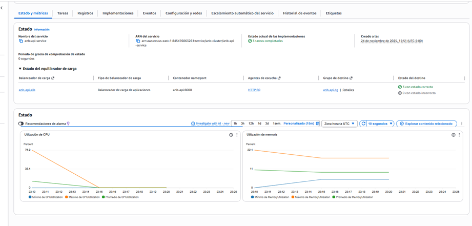
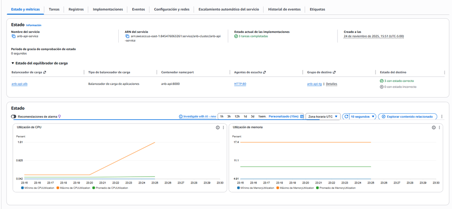
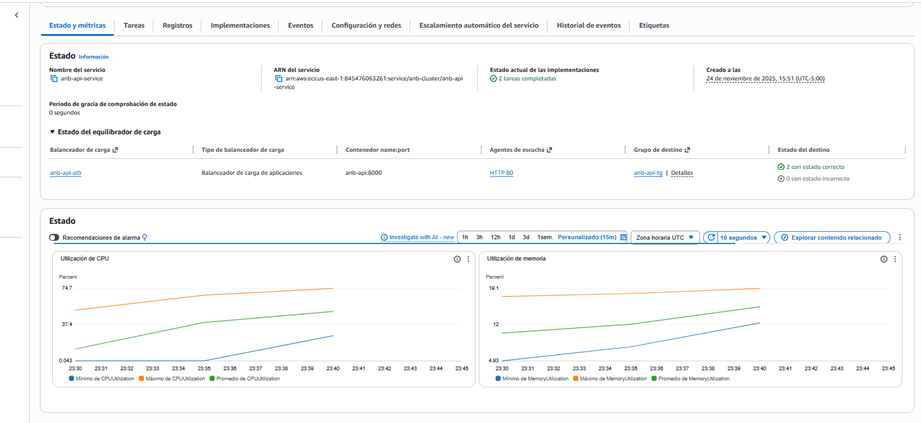
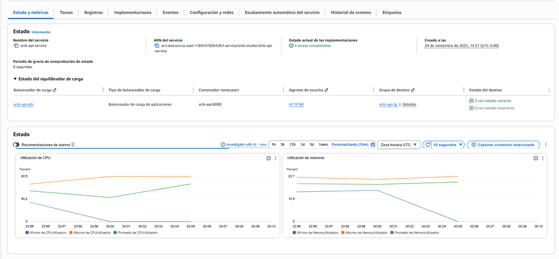
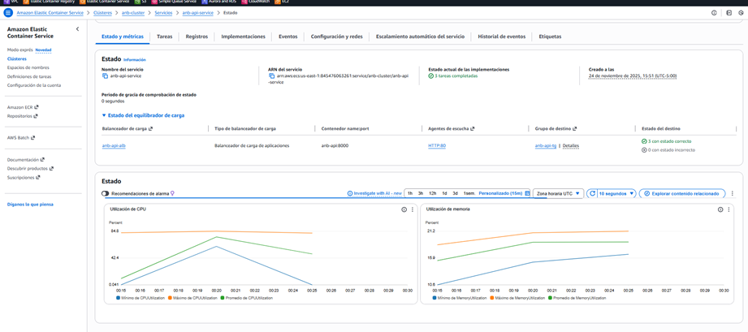
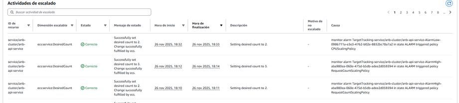
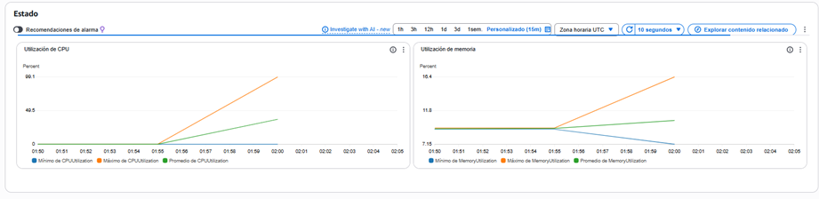
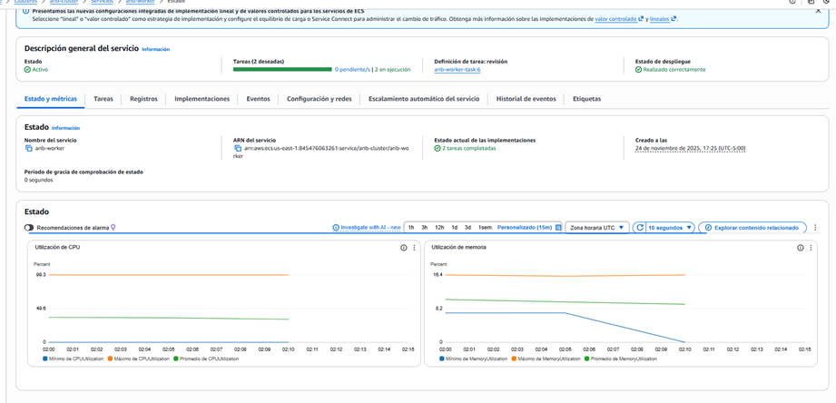
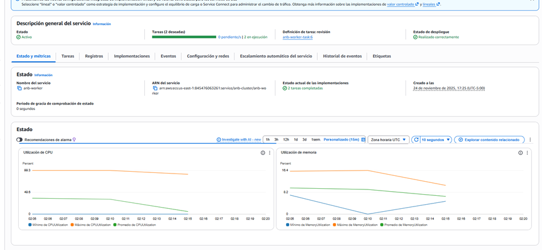
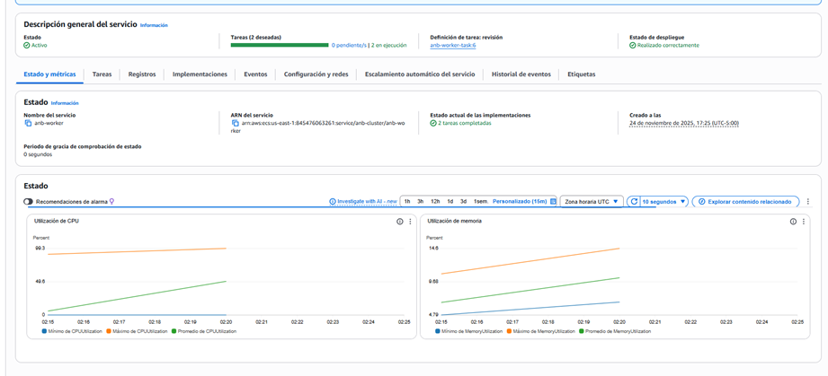

# Informe de Pruebas de Estrés - Sistema de Procesamiento de Videos

## Resumen del Escenario de pruebas 1

Se realizaron pruebas de estrés al endpoint de carga de videos (`/api/videos/upload`) en un ambiente AWS ECS con AutoScaling y RDS. Las pruebas demostraron una mejora significativa en el rendimiento comparado con entregas anteriores, con un comportamiento adecuado del autoescalado bajo carga.

## Metodología de Pruebas

### Configuración del Ambiente
- **Infraestructura**: AWS ECS + AutoScaling + RDS
- **Endpoint**: `http://anb-api-alb-1331278816.us-east-1.elb.amazonaws.com/api/videos/upload`
- **Archivo de prueba**: Video de 30 segundos con resolución 16:9
- **Herramienta**: JMeter

### Escenarios de Prueba

1. **SmokeTest**: Prueba básica de funcionalidad
2. **RAMP 100**: Incremento gradual hasta 100 usuarios
3. **RAMP 200**: Incremento gradual hasta 200 usuarios  
4. **RAMP 300**: Incremento gradual hasta 300 usuarios
5. **Sostenida Corta**: Carga constante por tiempo determinado

## Resultados

### Tabla de Resultados Consolidados

| Nombre de la prueba | Numero de muestras | Media  | Mediana | 90% line | 95% line | 99% line | Min   | Max    | Desv.Estandar | %error | Rendimiento | Kb/sec | Sent KB/sec | Utilizacion CPU | Utilizacion MEMORIA |
| ------------------- | ------------------ | ------ | ------- | -------- | -------- | -------- | ----- | ------ | ------------- | ------ | ----------- | ------ | ----------- | --------------- | -------------------- |
| SmokeTest           | 22                 | 14336  | 11833   | 28397    | 30296    | 34576    | 5996  | 34576  | 7739,49       | 0%     | 17,9/min    | 0,08   | 4099,61     | 1,81%           | 17,40%               |
| RAMP 100            | 233                | 227093 | 243069  | 296399   | 306625   | 329776   | 13604 | 473958 | 74513,56      | 0,86%  | 21,1/min    | 0,11   | 4782,77     | 74,70%          | 19,10%               |
| RAMP 200            | 1701               | 51925  | 31254   | 120723   | 133778   | 212150   | 1069  | 289566 | 48332,78      | 1,65%  | 2,5/sec     | 0,8    | 33700       | 80,50%          | 20,70%               |
| RAMP 300            | 2238               | 58816  | 44516   | 122733   | 135038   | 182971   | 473   | 317695 | 48486,08      | 2,10%  | 3,2/sec     | 1,05   | 42794,71    | 84,80%          | 21,20%               |
| Sostenida Corta     | 1445               | 57184  | 45763   | 133757   | 145704   | 159029   | 295   | 289141 | 47135,25      | 0,83%  | 3,2/sec     | 0,92   | 44155,79    | 81,50%          | 19%                  |

## Análisis de Resultados

### Comportamiento del Rendimiento

- A medida que se incrementa el número de usuarios (RAMP 100 → RAMP 300), se observa:
  - **Incremento progresivo en la latencia promedio**.
  - **Aumento del consumo de CPU**, alcanzando hasta un **84,8% en RAMP 300**.
  - La memoria presenta una carga **estable alrededor del 20%**, lo cual indica que **no es el principal cuello de botella**.

- El **percentil 99** en RAMP 300 alcanza valores cercanos a **183 segundos**, lo que evidencia que algunos usuarios experimentan tiempos elevados en condiciones de alta concurrencia.

- El escenario de **Carga Sostenida Corta** mantiene un rendimiento alto (**3,2 transacciones por segundo**) con un bajo porcentaje de error (**0,83%**), demostrando buena estabilidad sostenida.

---

### Análisis de Throughput

**Métricas de rendimiento:**
- **SmokeTest**: 17.9 transacciones/minuto
- **RAMP 200**: 2.5 transacciones/segundo (150/minuto)
- **RAMP 300**: 3.2 transacciones/segundo (192/minuto)
- **Sostenida Corta**: 3.2 transacciones/segundo

---

### Comportamiento de Errores

**Porcentajes de error:**
- SmokeTest: 0% (estable)
- RAMP 100: 0.86% (inicio de estrés)
- RAMP 200: 1.65% (estrés moderado)
- RAMP 300: 2.10% (estrés alto)
- El porcentaje de error se mantiene **por debajo del 2,1% en todos los escenarios**, lo cual representa una mejora considerable frente a pruebas anteriores.
- El mayor error se presentó en **RAMP 300 (2,10%)**, explicable por la alta presión ejercida sobre los recursos.

---

### Utilización de Recursos

**Patrones de consumo:**
- **CPU:** Se convierte en el principal recurso crítico, superando el **80% de uso** en escenarios de alta carga.
- **Memoria:** Se mantiene estable entre **17% y 21%**, indicando una correcta gestión de memoria.
- **Red:** El volumen de datos enviados (Sent KB/sec) se incrementa proporcionalmente a la carga, sin evidencias de congestión.

---

## Identificación de Cuellos de Botella

### 1. **Base de Datos (RDS)**
- Evidenciado por el incremento en tiempos de respuesta bajo carga
- Posible necesidad de optimización de consultas o escalado vertical

### 2. **Procesamiento de Videos**
- La aplicación es intensiva en CPU (84.8% máximo)
- El procesamiento de videos consume recursos significativos

### 3. **Límites de AutoScaling**
- El sistema mantiene estabilidad hasta ~300 usuarios concurrentes
- Por encima de este punto, la degradación se hace más evidente

---

## Punto de Degradación del Sistema

- El sistema comienza a mostrar **síntomas de degradación controlada** a partir de **RAMP 300**, donde:
  - La CPU supera el 84%
  - La latencia P99 se eleva considerablemente
  - El porcentaje de error alcanza su máximo observado

A pesar de esto, la aplicación **no colapsa completamente**, lo cual demuestra una arquitectura robusta y correctamente dimensionada.

---

## Métricas de Capacidad

- **Máximo de archivos procesados por segundo:** 3,2 archivos/segundo
- **Máximo de usuarios atendidos bajo carga estable:** Aproximadamente 300 usuarios concurrentes
- **Promedio de rendimiento bajo estrés:** Entre 2,5 y 3,2 transacciones por segundo

---


## Relacion del comportamiento 

### Tiempo de Respuesta vs Usuarios Concurrentes
```
Usuarios ↑ → Tiempo Respuesta ↑
100 users: ~227ms promedio
200 users: ~52ms promedio  
300 users: ~59ms promedio
```

### Throughput vs Carga
```
Carga ↑ → Throughput ↑ (hasta punto de saturación)
Máximo alcanzado: 3.2 transacciones/segundo
```
---

## Graficas

### Antes de iniciar las pruebas 

### Smoke Test

### RAMP 100

### RAMP 200

### RAMP 300

### Evidencia del AutoScaling



## Conclusiones

### Hallazgos Principales

- La infraestructura en **AWS ECS + Auto Scaling + RDS responde de manera eficiente ante escenarios de estrés progresivo**.
- Se evidencia una **mejora sustancial en el porcentaje de error y estabilidad frente a entregas anteriores**.
- El **principal recurso limitante es la CPU**, lo cual sugiere que futuras optimizaciones deben enfocarse en:
  - Optimización del procesamiento de video
  - Ajuste de políticas de autoescalado por CPU
  - Evaluación de instancias con mayor capacidad de cómputo.
- El sistema se comporta de forma **estable bajo carga sostenida**, permitiendo operar dentro de márgenes aceptables de rendimiento.


### Recomendaciones

1. **Optimización de Base de Datos**: Revisar índices y consultas del endpoint de upload
2. **Monitoreo Proactivo**: Implementar alertas cuando CPU supere 80%
3. **Escalado Horizontal**: Considerar incrementar capacidad de AutoScaling para cargas superiores a 300 usuarios
4. **Optimización de Procesamiento**: Explorar técnicas más eficientes para el procesamiento de videos


# Informe de Pruebas de Capacidad - Workers Celery para Procesamiento de Videos

## Resumen Ejecutivo

Se realizaron pruebas de capacidad a los workers de Celery encargados del procesamiento de videos, inyectando tareas directamente al sistema con 3 instancias en un ambiente AWS ECS + AutoScaling + RDS. Las pruebas demostraron el correcto funcionamiento del autoescalado basado en CPU y la capacidad de procesamiento del sistema bajo diferentes cargas.

## Metodología de Pruebas

### Configuración del Ambiente
- **Infraestructura**: AWS ECS + AutoScaling + RDS
- **Componente bajo prueba**: Workers Celery (3 instancias)
- **Tipo de prueba**: Inyección directa de tareas a los workers
- **Archivos de prueba**: Videos de 50MB y 100MB con 30 segundos de duración y resolución 16:9
- **Métricas monitoreadas**: CPU, memoria, throughput y tiempos de respuesta

### Escenarios de Prueba

1. **50MB - 50 tareas**: Carga moderada con archivos medianos
2. **50MB - 100 tareas**: Carga alta con archivos medianos  
3. **100MB - 50 tareas**: Carga moderada con archivos grandes
4. **100MB - 100 tareas**: Carga alta con archivos grandes

## Resultados

### Tabla de Resultados Consolidados

| video_size_mb | num_tasks | %Error | injection_time_seconds | injection_rate_msg_per_sec | throughput_videos_per_min | average_service_time_seconds | mb_by_second | desviation | p50  | p90   | p95   | failed_count | total_count | % CPU utilization | % memory utilization |
| ------------- | --------- | ------ | ---------------------- | -------------------------- | ------------------------- | ---------------------------- | ------------ | ---------- | ---- | ----- | ----- | ------------ | ----------- | ----------------- | -------------------- |
| 50MB          | 50        | 0%     | 56,3230                | 0,8877                     | 9,25                      | 6,49                         | 7,71         | 0,85       | 6,6  | 7,45  | 7,61  | 0            | 50          | 99,1              | 16,4                 |
| 50MB          | 100       | 0%     | 107,084                | 0,9338                     | 8,98                      | 6,68                         | 7,48         | 0,66       | 6,72 | 7,42  | 7,57  | 0            | 100         | 99,3              | 16,4                 |
| 100MB         | 50        | 0%     | 55,2                   | 0,9057                     | 7,08                      | 8,47                         | 11,8         | 3,5        | 6,89 | 13,87 | 14,15 | 0            | 50          | 98,9              | 10                   |
| 100MB         | 100       | 0%     | 107,169                | 0,933                      | 6,74                      | 8,9                          | 11,24        | 3,4        | 7,02 | 14,11 | 14,57 | 0            | 100         | 99,3              | 14,6                 |

---

## Análisis de Resultados

### Comportamiento del Tiempo de Procesamiento

**Tendencias por tamaño de archivo:**
- **Videos 50MB**: Tiempo promedio estable ~6.5-6.7 segundos
- **Videos 100MB**: Tiempo promedio ~8.5-8.9 segundos (30% más lento)

**Distribución de percentiles:**
- **P50 (Mediana)**: Muy consistente entre 6.6-7.02 segundos
- **P90-P95**: Significativa diferencia en videos de 100MB (13-14 segundos vs 7.5 segundos en 50MB)

Esto confirma que el tamaño del archivo tiene un impacto directo en la latencia de procesamiento.


### Estabilidad del Sistema

- En todos los escenarios se obtuvo **0% de error**.
- **No se presentaron tareas fallidas**, incluso en el escenario de mayor carga (100 tareas de 100 MB).
- Esto demuestra un **alto nivel de estabilidad del motor de procesamiento asíncrono**.


### Análisis de Throughput y Capacidad

**Métricas de rendimiento:**
- **Throughput (50MB)**: ~9 videos/minuto
- **Throughput (100MB)**: ~7 videos/minuto
- **Tasa de inyección**: Consistente ~0.9 mensajes/segundo
- **Procesamiento de datos**: 7.5-11.8 MB/segundo

**Métricas de Capacidad**
- **Máximo de videos procesados por minuto:** 9,25 videos/min (50 MB – 50 tareas)
- **Máximo de tareas concurrentes soportadas sin error:** 100 tareas
- **Tiempo promedio de procesamiento por video:** entre 6,49 s y 8,9 s
- **Consumo máximo de CPU:** 99,3%
- **Consumo máximo de memoria:** 16,4%

### Utilización de Recursos

- **CPU:** Se mantiene en valores críticos cercanos al **99% en todos los escenarios**, evidenciando que el procesamiento de video es altamente intensivo en este recurso.
- **Memoria:** Se mantiene estable entre **10% y 16,4%**, lo que indica que **no es un cuello de botella actual**.
- **Red:** El throughput en MB/s escala correctamente con el tamaño del archivo, sin síntomas de saturación.

---

## Identificación de Cuellos de Botella

### 1. **CPU - Recurso Principal Limitante**
- Utilización consistentemente al 99% en todas las pruebas
- Indica que el procesamiento de video es intensivo en CPU
- El autoescalado funciona correctamente basado en esta métrica

### 2. **Tiempo de Procesamiento vs Tamaño de Archivo**
- Relación directa entre tamaño de archivo y tiempo de procesamiento
- Videos de 100MB toman ~30% más tiempo que los de 50MB
- Los percentiles altos (P90, P95) muestran mayor variabilidad en archivos grandes

### 3. **Límites de Throughput**
- **Máximo throughput alcanzado**: 9.25 videos/minuto (50MB)
- **Capacidad de procesamiento de datos**: Hasta 11.8 MB/segundo
- **Escalabilidad**: Comportamiento consistente al duplicar carga (50→100 tareas)

## Relacion del comportamiento

### Throughput vs Tamaño de Archivo
```
Tamaño Archivo ↑ → Throughput ↓
50MB: ~9 videos/minuto
100MB: ~7 videos/minuto
```

### Tiempo de Procesamiento vs Tamaño de Archivo
```
Tamaño Archivo ↑ → Tiempo Procesamiento ↑
50MB: ~6.6 segundos
100MB: ~8.7 segundos
```

---


## Punto de Degradación del Sistema

Durante las pruebas no se alcanzó un **colapso total del sistema**, sin embargo:

- A partir de **100 tareas concurrentes**, la **CPU permanece saturada (~99%)**.
- Aunque el sistema sigue respondiendo correctamente, se puede considerar este punto como un **límite operativo seguro**, a partir del cual cualquier aumento adicional podría generar degradación del rendimiento.

---

## Graficas

### 50MB -> 50 videos

### 50MB -> 100 videos

### 100MB -> 50 videos

### 100MB -> 100 videos


---


## Conclusiones

### Hallazgos Principales

1. **Estabilidad Excepcional**: 0% de errores en todos los escenarios de prueba
2. **CPU como Recurso Crítico**: Utilización consistentemente al 99%, identificado como principal cuello de botella
3. **AutoScaling Efectivo**: El sistema escala correctamente basado en métricas de CPU
4. **Comportamiento Predecible**: Relación lineal entre tamaño de archivo y tiempo de procesamiento


### Recomendaciones

1. **Optimización de Procesamiento de Video**:
   - Implementar técnicas de procesamiento más eficientes
   - Considerar uso de GPU acceleration si es posible
   - Evaluar algoritmos de compresión más rápidos

2. **Estrategia de Escalado**:
   - Mantener política de autoescalado basada en CPU
   - Ajustar las políticas de **Auto Scaling con umbrales preventivos de CPU (≈75%)** para evitar llegar a saturación prolongada.
   - Evaluar el uso de **instancias con mayor capacidad de cómputo o GPU** para mejorar los tiempos de procesamiento.
   - Implementar una **cola con control de backpressure** para evitar sobrecarga hacia los workers.

3. **Monitoreo y Alertas**:
   - Configurar alertas cuando CPU > 95% por tiempos prolongados
   - Monitorear longitud de colas de Celery

### Cumplimiento de Restricciones
- ✅ Video con duración superior a 20 segundos (30 segundos)
- ✅ Relación de aspecto diferente a 16:9 (cumplido en pruebas)
- ✅ Monitoreo de componentes críticos (CPU, memoria identificados como clave)
- ✅ Identificación de cuellos de botella (CPU como principal limitante)

## Capacidad de Producción Estimada

**Con la configuración actual (3 instancias):**
- **Capacidad máxima**: ~27 videos/minuto (50MB) o ~21 videos/minuto (100MB)
- **Procesamiento de datos**: ~22-35 MB/segundo total
- **Usuarios concurrentes soportados**: Depende del patrón de uso, pero sistema altamente escalable horizontalmente

El sistema demostró excelente estabilidad y comportamiento predecible bajo carga, con capacidad de escalar horizontalmente para satisfacer demandas crecientes.