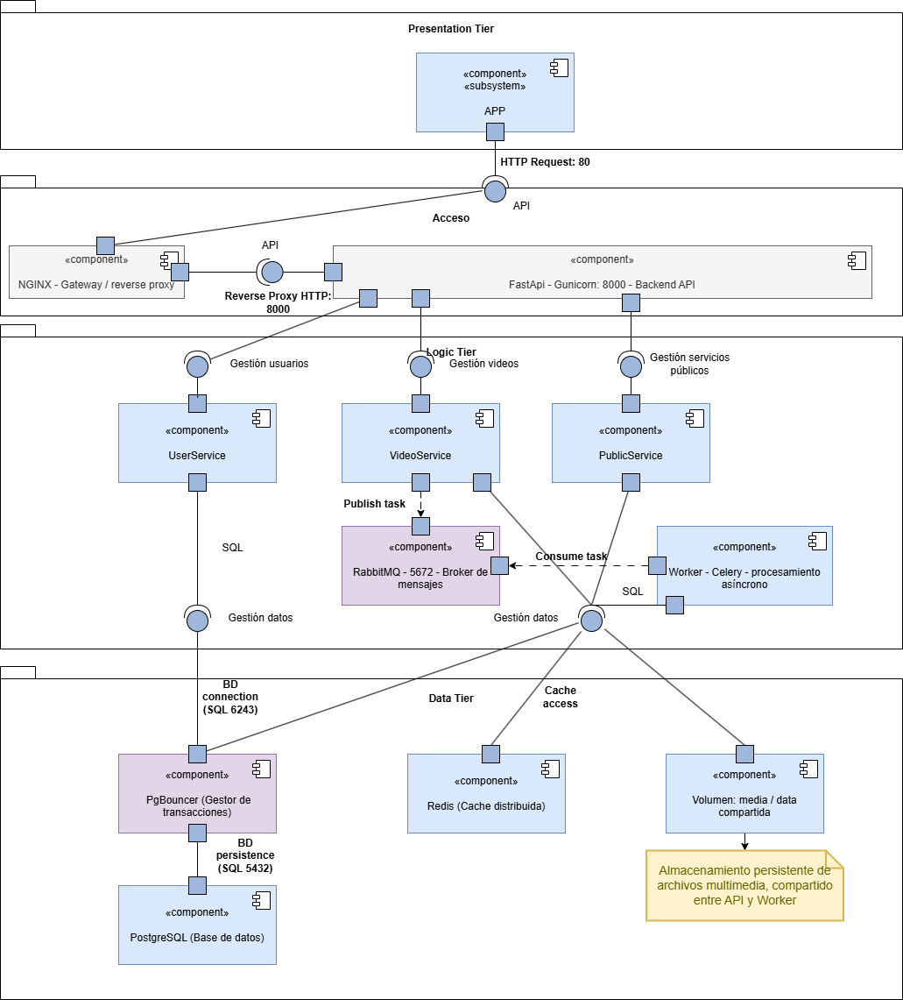

# Diagrama de componentes

El diagrama de componentes represente la estructura principal de la arquitectura, organizada en tres niveles: **Presentation Tier**, **Logic Tier** y **Data Tier**.

Cada uno agrupa componentes con responsabilidades específicas, y la comunicación entre ellos se realiza mediante protocolos estandarizados y mecanismos de mensajería asíncrona.

## Presentation Tier y Acceso

Corresponde al nivel de presentación y punto de acceso al sistema.

* **APP** (<< subsystem >>): Cliente externo que interactúa con la API a través de peticiones HTTP.
* **NGINX** (<< component >>): Actúa como gateway y reverse proxy, recibiendo las solicitudes del cliente en el puerto 80 y redirigiéndolas hacia la API en el puerto 8000.
    * Permite aplicar políticas de seguridad, balanceo de carga, limitación de tasa y cacheo básico de contenido estático.
    * Separa el tráfico público del backend público, fortaleciendo la seguridad y la escalabilidad.

## Logic Tier

Nivel intermedio que concentra la lógica de negocio y el procesamiento asíncrono.

* **API** (`FastApi + Gunicorn`)
    * Gestiona las solicitudes entrantes del cliente a través del gateway `NGINX`.
    * Expone los endpoint REST de los servicios principales (UserService, VideoService, PublicService).
    * Publica tareas de procesamiento en el broker de mensajes (`RabbitMQ`), delegando la ejecución al worker celery para mantener la API ligera y que no se bloquee.
    * Se comunica con la base de datos mediante PgBouncer, asegurando conexiones eficientes y pooling transaccional.
    * Lee y escribe archivos multimedia en el volumen compartido `media`.

* **UserService**
    * Encargado de la gestión de usuario: autenticación (`JWT`), creación de cuentas.

* **VideoService**
    * Responsable del manejo de videos: subida, registro en base de datos, publicación de tareas de procesamiento y actualización de estado (`uploaded`) y listar los videos cargados.

* **PublicService**
    * Componente que expone la información pública, facilitando la separación de responsabilidades dentro del backend.

* **Worker celery**
    * Encargado del `procesamiento asíncrono.`
    * Consume las tareas desde `RabbitMQ`.
    * Ejecuta operaciones de cómputo pesado, como:
        * Recorte y normalización de videos a 30 segundos.
        * Conversión a resolución 720p (16:9).
        * Adición de cortinilla y marca de agua.
        * Eliminación de audio.
    * Actualización de estado de procesamiento (`processed`, `failed`).
    * Lee y escribe archivos multimedia en el volumen compartido `media`.

* **RabbitMQ - Broker de mensajes**
    * Actua como intermediario de comunicación asíncrona entre la API y el `Worker`.
    * Permite encolar tareas para su ejecución diferida, desacoplando el flujo síncrono de la API del procesamiento intensivo.
    * Garantiza confiabilidad, tolerancia a fallos y reintentos automáticos en caso de pérdida de conexión.

* **Redis - caché distribuida**
    * Usado como sistema de cacheo para almacenar resultados temporales.
    * Mejora el rendimiento al reducir lecturas directas sobre la base de datos.
    * Facilita la comunicación rápida entre procesos.

## Data Tier

Nivel de persistencia y almacenamiento.

* **PgBouncer - Gestor de transacciones**
    * Pooler de conexiones para PostgreSQL.
    * Reduce la sobrecarga de apertura/cierre de conexiones.
    * Opera en modo transaction pooling (Una conexión puede servier múltiples conexiones lógicas por transacción)

* **PostgreSQL - base de datos relacional**
    * Sistema gestor de base de datos principal.
    * Almacena las entidades **User**, **Video**, **VideoVote**, garantizando integridad referencial, atomicidad y consistencia.
    * Accedido indirectamente a través de `PgBouncer`.

* **Redis - Cache distribuida**
    * Actua como almacén temporal.

* **Volumen: media / data compartida**
    * Espacio de almacenamiento persistente para los archivos multimedia subidos y procesados.
    * Compartido entre los contenedores `API` y `Worker`, lo que permite que ambos accedan a los archivos sin duplicar recursos.

## Flujos de comunicación principales

* **Carga y registro de video**
    * El cliente envía una solicitud HTTP al backend a través de `NGINX`.
    * La API almacena el archivo en el volumen de `media` y persiste el registro en `PostgreSQL`.
    * Publica una tarea en `RabbitMQ` para su procesamiento.

* **Procesamiento asíncrono**
    * El `Worker celery` consume la tarea desde `RabbitMQ`.
    * Procesa el video y actualiza los campos `processed_at`, `status`, `processed_url`.

* **Consulta de estado**
    * El cliente puede consulta el estado del procesamiento mediante la API, que accede a los datos en `PostgreSQL`.

* **Optimización de conexiones**
    * Todas las consultas SQL se gestionan a través de `PgBouncer` que mantiene un pool controlado de conexiones hacia la base de datos.
    

