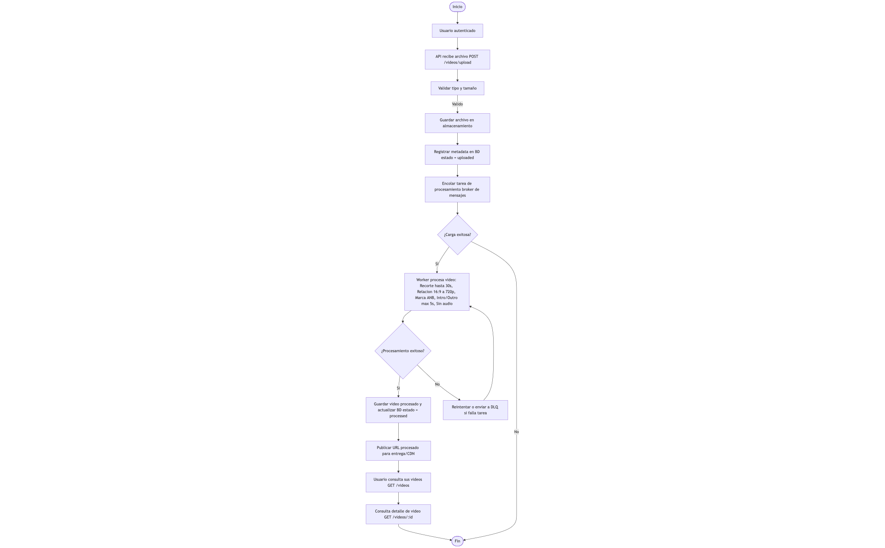

# Diagrama de Flujo

Este documento describe el **flujo completo (end-to-end)** del sistema de carga, procesamiento y entrega de videos, implementado mediante una **API REST asíncrona con workers y cola de mensajes**.  

El objetivo es representar gráficamente cómo los diferentes componentes interactúan desde el momento en que el usuario sube un archivo hasta que obtiene el video procesado.

---

## Objetivo del Flujo

- Representar las etapas del proceso: **Carga → Procesamiento → Entrega**.  
- Identificar los **componentes involucrados** (API, worker, almacenamiento, base de datos, CDN).  
- Mostrar cómo se manejan **errores y reintentos** mediante una cola de mensajes (**DLQ**).  
- Entender los **estados del video** (`uploaded` → `processed`).

---

## Etapas del Flujo

| Etapa | Descripción |
|--------|--------------|
| **Inicio** | El proceso comienza con un usuario autenticado que desea subir un video. |
| **Carga (API)** | La API recibe el archivo, valida su tipo y tamaño, guarda el original y registra la metadata en la base de datos con estado `uploaded`. |
| **Encolado** | Se envía una tarea al broker de mensajes (por ejemplo, Redis, RabbitMQ o Kafka) para que un *worker* procese el video. |
| **Procesamiento (Worker)** | El *worker* ejecuta la transformación: recorte máximo 30s, resolución 720p (16:9), marca de agua “ANB”, intro/outro ≤5s, y elimina el audio. |
| **Reintentos / DLQ** | Si ocurre un error, se reintenta la tarea varias veces. Si sigue fallando, se envía a la **DLQ (Dead Letter Queue)** para su análisis posterior. |
| **Actualización de estado** | Cuando el procesamiento es exitoso, la base de datos se actualiza a `processed` y se registran las URLs de los archivos. |
| **Publicación / Entrega** | El archivo procesado se publica en un sistema de entrega estática (CDN o almacenamiento) para acceso público o autenticado. |
| **Consulta** | El usuario puede listar sus videos (`GET /videos`) o ver el detalle (`GET /videos/:id`), con enlaces al archivo original y al procesado. |
| **Fin** | El proceso termina cuando el usuario accede o descarga el archivo final. |

---

## Glosario de Conceptos Clave

### JWT (JSON Web Token)
Mecanismo de autenticación usado por la API para validar que el usuario está autorizado a subir y consultar videos.

### Broker de Mensajes
Sistema intermedio (como **RabbitMQ**, **Redis** o **Kafka**) que almacena tareas pendientes para ser ejecutadas por workers. Permite manejar procesamiento **asíncrono** y escalar horizontalmente.

### Worker
Proceso independiente que consume mensajes del broker y ejecuta las tareas pesadas de procesamiento (en este caso, transformación de video).  
Permite que la API sea rápida y no quede bloqueada durante el procesamiento.

### Almacenamiento
Repositorio donde se guardan los archivos originales y los procesados. Puede ser local o en la nube (S3, Azure Blob, etc.).

### CDN (Content Delivery Network)
Red de servidores distribuidos que entrega contenido estático (videos, imágenes, etc.) de forma más rápida, cercana al usuario y sin sobrecargar el backend.

### DLQ (Dead Letter Queue)
Cola especial donde se almacenan las tareas que no pudieron procesarse correctamente incluso después de varios intentos.  
Sirve para analizar errores y evitar pérdida de datos.

---

## Beneficios del Diseño

| Beneficio | Descripción |
|------------|--------------|
| **Asincronía** | El usuario no espera mientras se procesa el video. La API responde inmediatamente. |
| **Escalabilidad** | Se pueden ejecutar múltiples workers para procesar videos en paralelo. |
| **Resiliencia** | Los errores no bloquean el sistema; los mensajes fallidos se aíslan en la DLQ. |
| **Eficiencia** | El CDN optimiza la entrega de contenido estático. |
| **Observabilidad** | Cada paso (upload, encolado, procesamiento, entrega) tiene trazabilidad en la BD. |

---

## Estados del Video

| Estado | Descripción |
|---------|--------------|
| **uploaded** | Video recibido y almacenado; pendiente de procesamiento. |
| **processing** *(opcional)* | En curso de transformación por el worker. |
| **processed** | Video final disponible con URL pública o autenticada. |
| **failed** | Error en procesamiento; tarea enviada a DLQ. |

---
