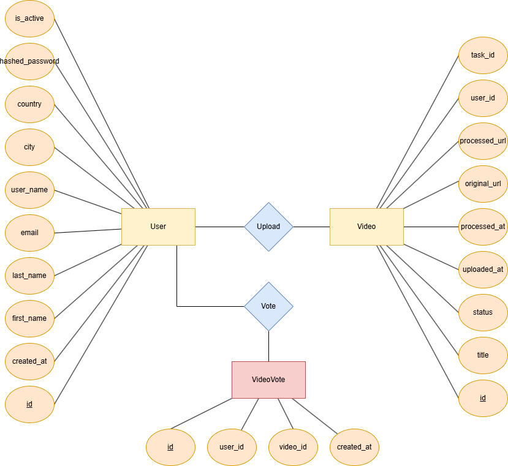
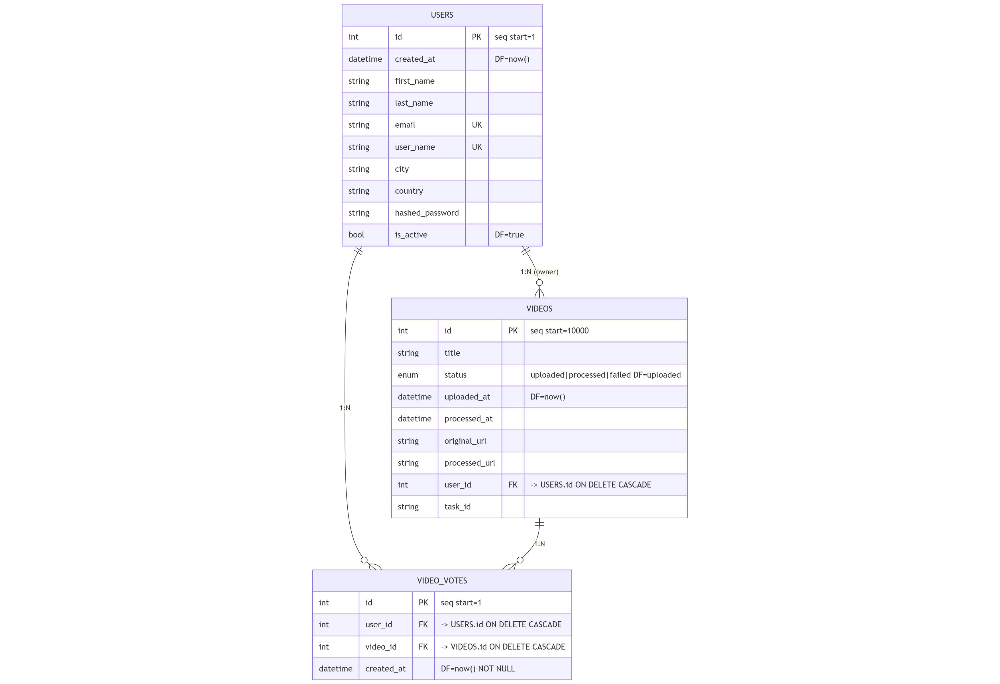

# Modelo de datos

El modelo de datos defina las **entidades principales** del sistema, sus **atributos** y las **relaciones**.

### Entidades
* **User**: Representa a los usuarios registrados en la plataforma. Contiene atributos básicos de identificación (`first_name`, `last_name`, `email`, `user_name`, `city`, `county`) y de autenticación (`hashed_password`, `is_active`)

* **Video**: Representa los videos cargados por los usuarios, incluye información acerca del video (`title`, `original_url`, `uploaded_at`) e información acerca de su procesamiento (`status`, `processed_at`, `processed_url`).

* **VideoVote**: Representa la interacción entre los usuarios y los videos, registrando votos a los videos.

### 🔗 Relaciones

* **USER -> VIDEO: 1:N**
    * Cada usuario puede subir múltiples videos. 
    
    Si el usuario se elimina, sus videos también se eliminan (Borrado en cascada).

* **USER -> VIDEO_VOTES: 1:N**
    * Un usuario puede emitir varios votos, pero cada voto pertenece a un único usuario

* **VIDEO -> VIDEO_VOTES: 1:N**
    * Un video puede recibir múltiples votos, pero cada voto está vinculado a un único video.

## Diagrama conceptual

El diagrama conceptual representa las entidades y relaciones a alto nivel, sin incluir detalles de tipos de datos.

* **Relaciones principales**:
    * **Upload**: Un User puede subir uno o varios videos (Relacion 1:N)
    * **Vote**: Un User puede votar por varios videos, pero un mismo par (User, Video) sólo puede aparecer una vez (Relacion N:M).

  

## Diagrama lógico

El diagrama lógico muestra la estructura de las tablas en la base de datos, con los tipos de datos, claves primarias, foráneas y restricciones relevantes.

  

## Tablas

`USER` 
| Campo                     | Tipo        | Descripción                                  |
| ------------------------- | ----------- | -------------------------------------------- |
| `id`                      | int (PK)    | Identificador único del usuario.             |
| `created_at`              | datetime    | Fecha de creación del registro (`DF=now()`). |
| `first_name`, `last_name` | string      | Nombres del usuario.                         |
| `email`                   | string (UK) | Correo único.                                |
| `user_name`               | string (UK) | Nombre de usuario único.                     |
| `city`, `country`         | string      | Ubicación opcional.                          |
| `hashed_password`         | string      | Contraseña cifrada.                          |
| `is_active`               | bool        | Indicador de cuenta activa (`DF=true`).      |

`VIDEO` 
| Campo           | Tipo                      | Descripción                                                               |
| --------------- | ------------------------- | ------------------------------------------------------------------------- |
| `id`            | int (PK, seq start=10000) | Identificador secuencial del video.                                       |
| `title`         | string                    | Título del video.                                                         |
| `status`        | enum                      | Estado del video (`uploaded`, `processed`, `failed`, default=`uploaded`). |
| `uploaded_at`   | datetime                  | Fecha de carga (`DF=now()`).                                              |
| `processed_at`  | datetime                  | Fecha de finalización del procesamiento (nullable).                       |
| `original_url`  | string                    | Ruta del video original.                                                  |
| `processed_url` | string                    | Ruta del video procesado (nullable).                                      |
| `user_id`       | int (FK)                  | Relación con `USERS.id` (`ON DELETE CASCADE`).                            |
| `task_id`       | string                    | Identificador del proceso de Celery asociado.                             |

`VIDEO_VOTES` 
| Campo        | Tipo       | Descripción                                           |
| ------------ | ---------- | ----------------------------------------------------- |
| `id`         | int (PK)   | Identificador del voto.                               |
| `user_id`    | int (FK)   | Referencia a `USERS.id` (`ON DELETE CASCADE`).        |
| `video_id`   | int (FK)   | Referencia a `VIDEOS.id` (`ON DELETE CASCADE`).       |
| `created_at` | datetime   | Fecha del voto (`DF=now()`, NOT NULL).                |
| —            | constraint | `UNIQUE(user_id, video_id)` — evita votos duplicados. |

---
