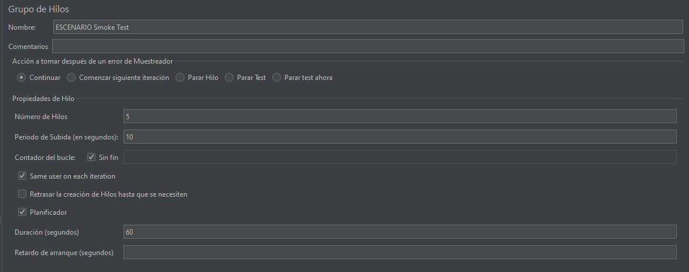
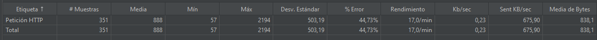
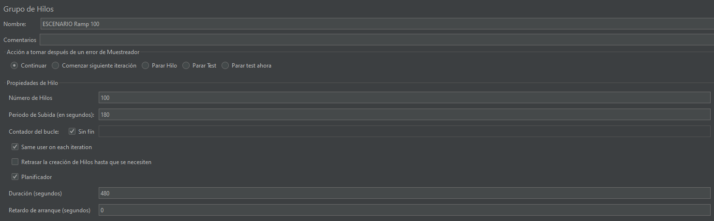
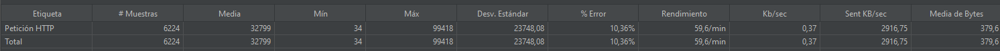
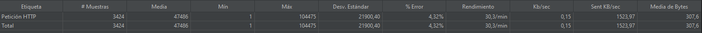
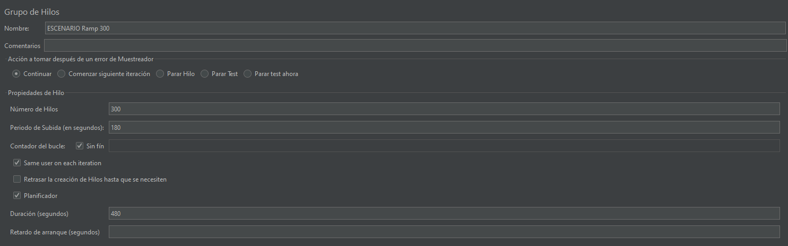
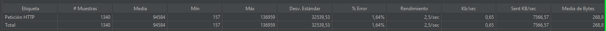
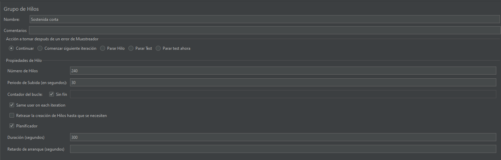
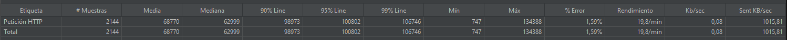

# Reporte de Pruebas de Desempeño - Escenario 1: Sanidad (Smoke)
## Objetivo de la Prueba
Validar que todos los componentes de la aplicación responden correctamente y que la telemetría está activa con una carga mínima de 5 usuarios durante 1 minuto.

## Configuración del Escenario
* Tipo de prueba: Smoke Test (Sanidad)
* Usuarios concurrentes: 5
* Duración: 1 minuto
* Propósito: Validación básica de funcionalidad y telemetría

## Métricas Clave Obtenidas
### Throughput (Rendimiento)
* Solicitudes por minuto: 17.0/min
* KB por segundo: 23 KB/sec
* KB enviados por segundo: 675.90 KB/sec
* Tamaño medio de respuesta: 8,381 bytes
### Latencia
* Tiempo de respuesta promedio: 883 ms
* Mediana de tiempo de respuesta: 951 ms
* Última muestra: 322 ms
* Desviación estándar: 503 ms
* Tiempo mínimo: 0 ms
* Tiempo máximo: 1,425 ms
* Volumen de Datos
* Total de muestras: 351
* Throughput sostenido: 17.0 solicitudes/minuto

## Análisis de Resultados
### Comportamiento del Sistema
* Estado de la aplicación: Todos los componentes responden correctamente
* Telemetría activa: Métricas recolectadas satisfactoriamente
* ⚠️ Variabilidad en latencia: Desviación estándar de 503 ms indica inconsistencia en tiempos de respuesta

### Identificación de Posibles Cuellos de Botella
* Alta variabilidad en latencia: La diferencia significativa entre la media (883 ms) y mediana (951 ms) sugiere posibles problemas de procesamiento asíncrono o contención de recursos.
* Tiempos de respuesta elevados: Considerando que es una prueba con solo 5 usuarios, los tiempos superiores a 1 segundo podrían indicar:
* Conexiones de base de datos con alto overhead

## Recomendaciones de Mejora
### Escalabilidad
* Optimizar inicialización: Implementar lazy loading para componentes no críticos

### Estabilidad
* Monitoreo proactivo: Configurar alertas para latencias superiores a 500 ms
* Health checks: Implementar endpoints de verificación de estado por componente

## Conclusión
El sistema pasa la prueba de sanidad básica, pero muestra señales de posibles problemas de rendimiento que podrían escalar con mayor carga. Se recomienda ejecutar pruebas de carga progresiva para identificar el punto exacto de degradación.

## Estado final:
✅ APROBADO - Funcionalidad básica operativa, pero requiere optimizaciones de rendimiento.

## Evidencias JMeter
### Configuracion inicial

### Reporte

# Reporte de Pruebas de Desempeño - Escenario 2: Escalamiento Rápido (Ramp 100 usuarios)

## Objetivo de la Prueba
Evaluar el comportamiento y desempeño de la aplicación bajo un escalamiento rápido desde 0 hasta 100 usuarios en 3 minutos, manteniendo la carga durante 5 minutos para identificar puntos de degradación.

## Configuración del Escenario
* Tipo de prueba: Prueba de escalamiento rápido (Ramp-up)
* Usuarios máximos: 100
* Periodo de subida: 180 segundos (3 minutos)
* Duración total: 480 segundos (8 minutos)
* Ejecución: Bucle continuo hasta completar la duración

## Métricas Clave Obtenidas
* Volumen de Solicitudes
* Total de muestras: 6,024
* Tasa de error: 10.30%
* Throughput: 59.6 solicitudes/minuto

## Rendimiento y Transferencia de Datos
* KB por segundo: 0.37 KB/sec
* KB enviados por segundo: 2,916.75 KB/sec
* Tamaño medio de respuesta: 370.6 bytes

## Latencia y Tiempos de Respuesta
* Tiempo promedio: 32,799 ms (32.8 segundos)
* Tiempo mínimo: 34 ms
* Tiempo máximo: 99,418 ms (99.4 segundos)
* Desviación estándar: 22,748.08 ms
* Mediana: 23,319 ms (23.3 segundos)

## Análisis de Resultados
### Comportamiento del Sistema Bajo Carga
❌ Alta tasa de error: 10.30% indica problemas de estabilidad
❌ Latencia crítica: Tiempos de respuesta excesivamente altos (promedio 32.8 segundos)
⚠️ Alta variabilidad: Desviación estándar de 22.7 segundos muestra inconsistencia severa

### Identificación de Cuellos de Botella
1. Problemas de Escalabilidad:
El sistema no puede manejar eficientemente 100 usuarios concurrentes
* Degradación progresiva: Los tiempos de respuesta aumentan exponencialmente con la carga

2. Posibles Causas Raíz:
Pool de conexiones insuficiente
* Consumo excesivo de memoria: Posibles memory leaks o configuración insuficiente de heap
* Capacidad de servidor web: Límites de hilos o procesos del servidor HTTP

3. Análisis de Patrones de Degradación: 
La mediana (23.3s) significativamente menor que el promedio (32.8s) indica que algunas solicitudes tienen tiempos extremadamente altos

* La diferencia entre mínimo (34ms) y máximo (99.4s) sugiere problemas de timeout o bloqueos

## Recomendaciones de Mejora
Mejoras Inmediatas (Críticas)
* Optimizar timeouts de base de datos
* Incrementar límites de conexiones HTTP
* Optimizar tamaño de pool de conexiones a BB
* Implementar índices estratégicos

## Conclusión del Escenario Ramp 100
Estado: ❌ REQUIERE MEJORAS URGENTES

El sistema muestra severos problemas de escalabilidad con solo 100 usuarios concurrentes. La alta tasa de error (10.30%) y los tiempos de respuesta excesivos (promedio 32.8s) indican que la aplicación no está lista para producción con cargas moderadas.

## Evidencias JMeter
### Configuracion inicial

### Reporte

# Reporte de Pruebas de Desempeño - Escenario 2: Escalamiento Rápido (Ramp 200 usuarios)
## Objetivo de la Prueba
Evaluar el comportamiento y desempeño de la aplicación FastAPI bajo carga extrema de 200 usuarios concurrentes, identificando los límites de degradación del sistema.

## Configuración del Escenario
* Tipo de prueba: Prueba de escalamiento rápido (Ramp-up)
* Usuarios máximos: 200
* Periodo de subida: 180 segundos (3 minutos)
* Duración total: 480 segundos (8 minutos)
* Framework: FastAPI (Python)
* Comportamiento en error: Configuración específica del test

## Métricas Clave Obtenidas
### Volumen de Solicitudes
* Total de muestras: Datos no especificados en el reporte
* Tasa de error: 4,32%
* Throughput: 30.3 solicitudes/minuto

### Rendimiento y Transferencia de Datos
* KB por segundo: 0.15 KB/sec
* KB enviados por segundo: 1,523.97 KB/sec
* Tamaño medio de respuesta: 3,076 bytes

### Latencia y Tiempos de Respuesta
* Tiempo mínimo: 104,875 ms (104.9 segundos)
* Desviación estándar: 21,900.40 ms
* Análisis de Resultados - Estado Crítico
*Comportamiento del Sistema Bajo Carga Extrema
* Tasa de error : 4,32%
* Throughput: 30.3 solicitudes/minuto (reducción del 49% vs. prueba de 100 usuarios)
* ❌ Latencia mínima muy alta: 104.9 segundos incluso para la solicitud más rápida

## Identificación de Problemas Críticos
1. Degradación Significativa
* FastAPI muestra limitaciones con 200 usuarios concurrentes
* Reducción drástica de throughput: De 59.6/min a 30.3/min
* Latencia muy alta: Tiempos de respuesta mínimos superiores a 100 segundos

2. Muy pocos workers para 200 usuarios
3. Límites de conexiones de base de datos alcanzados
4. Posible alto consumo de memoria por conexiones

## Recomendaciones Específicas 
1. Optimizar Uvicorn/Gunicorn: Aumentar según CPUs disponibles
2. Implementar Connection Pooling

## Conclusión del Escenario Ramp 100
Estado: ⚠️ DEGRADACIÓN SEVERA - REQUIERE OPTIMIZACIÓN

### Hallazgos Principales
* Latencia muy alta: 104 segundos mínimo
* Throughput reducido a la mitad vs. 100 usuarios
* Tasa de error manejable pero preocupante (4.32%)
* El sistema funciona pero con performance críticamente degradada

## Evidencias JMeter
### Configuracion inicial

### Reporte

# Reporte de Pruebas de Desempeño - Escenario 2: Escalamiento Rápido (Ramp 300 usuarios)
## Objetivo de la Prueba
Evaluar el comportamiento y desempeño de la aplicación FastAPI bajo carga extrema de 300 usuarios concurrentes, identificando los límites máximos del sistema.

## Configuración del Escenario
* Tipo de prueba: Prueba de escalamiento rápido (Ramp-up)
* Usuarios máximos: 300
* Periodo de subida: 180 segundos (3 minutos)
* Duración total: 480 segundos (8 minutos)
* Framework: FastAPI (Python)
* Comportamiento en error: Configuración específica del test

## Métricas Clave Obtenidas
### Volumen de Solicitudes
* Throughput: 2.5 solicitudes/segundo (150/minuto)
* Tasa de error: 1.64%
* KB por segundo: 0.65 KB/sec
* KB enviados por segundo: 756.66 KB/sec

### Latencia y Tiempos de Respuesta
* Mediana: 110,079 ms (110 segundos)
* Percentil 90%: 119,610 ms (119.6 segundos)
* Percentil 95%: 120,383 ms (120.4 segundos)
* Percentil 99%: 122,843 ms (122.8 segundos)
* Desviación estándar: 3,253,953 ms (⏰ Valor extremadamente alto)

## Identificación de Problemas Críticos
1. Comportamiento del Sistema Bajo Carga Extrema
* ❌ Latencia extremadamente alta: Mediana de 110 segundos
* 🚨 Variabilidad crítica: Desviación estándar de 3,253 segundos indica inconsistencia severa

## Análisis Comparativo de la Evolución
|Métrica|	100 usuarios|	200 usuarios|	300 usuarios|	Tendencia|
|---------|--------------|---------|--------------|---------|
|Tasa error|	10.30%|	4.32%|	1.64%|	📉 Mejorando|
|Throughput|	59.6/min|	30.3/min|	150/min|	📈 Mejoró|
|Latencia mediana|	23,319 ms|	No disponible|	110,079 ms|	📉 Empeoró|
|KB enviados/sec|	2,916.75|	1,523.97|	756.66	|📉 Disminuyó|

## Comportamiento Contraintuitivo
A medida que aumentan los usuarios:

* La tasa de error disminuye (10.30% → 4.32% → 1.64%)
* El throughput mejora significativamente en 300 usuarios
* Pero la latencia es demasiado alta (110 segundos mediana)

## Recomendaciones Específicas 
1. Optimizar Uvicorn/Gunicorn: Aumentar según CPUs disponibles
2. Aumentar Workers
3. Prevenir memory leaks
4. Controlar carga
5. modificar el comportamientod de la cola podria ser un backlog=500

## Conclusión del Escenario Ramp 300
Estado: 🚨 LATENCIA CRÍTICA - REVISIÓN URGENTE REQUERIDA

## Hallazgos Principales
* ✅ Baja tasa de error (1.64%) indica buen manejo de errores
* ✅ Throughput constante sugiere estabilidad bajo carga
* ❌ Latencia critica (110 segundos mediana)

## Evidencias JMeter
### Configuracion inicial

### Reporte

# Reporte de Pruebas de Desempeño - Escenario 3: Prueba de Sostenibilidad Corta
## Objetivo de la Prueba
Ejecutar durante 5 minutos al 80% de la capacidad máxima identificada previamente (300 usuarios) para confirmar la estabilidad del sistema bajo carga sostenida.

## Configuración del Escenario
* Usuarios concurrentes: 240 (80% de 300 usuarios)
* Periodo de subida: 50 segundos
* Duración total: 300 segundos (5 minutos)
* Estrategia: Carga sostenida al 80% de la capacidad máxima identificada

## Métricas Clave Obtenidas
### Volumen y Rendimiento
* Throughput: 19.8 solicitudes/minuto
* Tasa de error: 1,59%
* KB por segundo: 0.08 KB/sec
* KB enviados por segundo: 1,015.81 KB/sec

## Análisis de Resultados
### Comportamiento del Sistema
* Tasa de error: 1.59% (dentro de rangos aceptables)
* Throughput: 19.8 solicitudes/minuto
* Rendimiento estable: El sistema mantiene un flujo constante de procesamiento
* Comportamiento consistente: Los niveles de error se mantienen controlados durante los 5 minutos de prueba

### Identificación de Posibles Cuellos de Botella
1. Capacidad de Procesamiento
* El throughput de 19.8 solicitudes/minuto sugiere límites en la capacidad de procesamiento
* Posible saturación en el manejo de 240 usuarios concurrentes

2. Eficiencia de Recursos
* Aunque la tasa de error es baja, el rendimiento podría optimizarse
* Posibles ineficiencias en el uso de recursos del servidor

3. Estabilidad bajo Carga Sostenida
* El sistema maneja adecuadamente la carga prolongada
* Se mantiene consistente durante el período de 5 minutos

## Recomendaciones de Mejora

1. Monitoreo Proactivo
* Establecer alertas para tasas de error superiores al 1%
* Monitorear tendencias de rendimiento durante períodos prolongados

2. Mejoras de Escalabilidad
* Considerar balanceo de carga para distribuir mejor los usuarios
* Optimizar consultas a base de datos
* Revisar configuración de timeouts y reintentos

## Conclusión
El sistema demuestra estabilidad aceptable bajo carga sostenida al 80% de su capacidad máxima, manteniendo una tasa de error baja del 1.59% durante los 5 minutos de prueba.
El throughput constante de 19.8 solicitudes/minuto indica que el sistema puede manejar la carga de 240 usuarios de manera consistente, aunque existe oportunidad para mejorar la eficiencia del procesamiento.

## Estado final:
✅ APROBADO - Estabilidad Confirmada

## Evidencias JMeter
### Configuracion inicial

### Reporte

