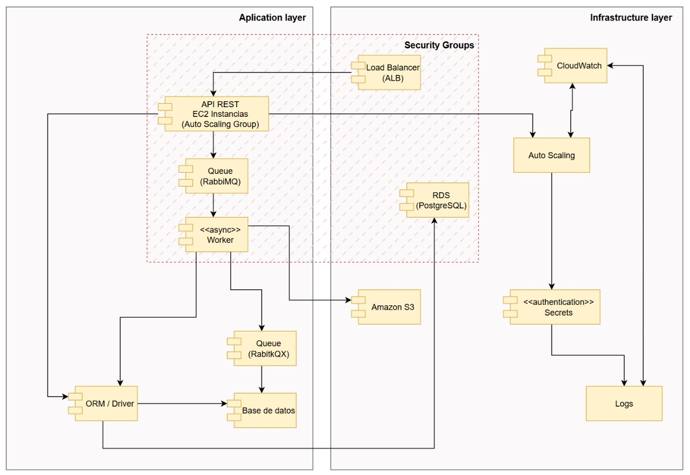

# Diagrama de componentes

# Application Layer (Lógica de la aplicación)

## API REST (EC2 Instances / Auto Scaling Group)
* Servicio principal de la aplicación (FastAPI + Gunicorn).
* Está detrás del Load Balancer (ALB).
* Escala automáticamente según la carga gracias al Auto Scaling Group.
* Expone los endpoints públicos (como /health o tus endpoints de negocio).

## Queue (RabbitMQ)
* Cola de mensajería que recibe las tareas que la API REST encola para ser procesadas de forma asíncrona.
* Permite desacoplar el procesamiento pesado de la solicitud del cliente.
* Ejemplo: procesamiento de videos, validaciones o subidas a S3.

## Worker (asynchronous)
* Consume mensajes de la cola RabbitMQ.
* Realiza tareas pesadas (por ejemplo, subir archivos, ejecutar cálculos, actualizar base de datos).
* Puede enviar resultados o estados a la cola RabbitQX.

## Queue (RabbitQX)
* Cola secundaria que recibe los resultados o eventos generados por el Worker.
* Permite informar a la API REST o a otros procesos del sistema que una tarea terminó o falló.

## Amazon S3
* Servicio de almacenamiento de objetos.
* El Worker sube los resultados procesados aquí (por ejemplo, videos o reportes).
* La API REST puede consultar S3 a través de URLs firmadas o presignadas.

## Base de datos
* Almacena los datos de negocio o metadatos de las operaciones.
* El Worker y la API REST se comunican con ella mediante el ORM/Driver.
ORM / Driver
* Componente de software que conecta la lógica de aplicación (Python ORM, por ejemplo SQLAlchemy) con el motor de base de datos relacional (PostgreSQL).

---
# Infrastructure Layer (Servicios AWS de soporte)

## Load Balancer (ALB)
* Reparte las peticiones entrantes entre las instancias del Auto Scaling Group.
* Hace las comprobaciones de salud (/health) para determinar si una instancia está activa.

## Auto Scaling
* Supervisa el uso de CPU, memoria u otras métricas (a través de CloudWatch) y lanza o termina instancias según la carga.
* Se asocia a la plantilla de lanzamiento (Launch Template) que define la AMI, tipo de instancia y configuración de red.

## RDS (PostgreSQL)
* Servicio administrado de base de datos.
* Proporciona persistencia de datos relacionales.
* Se comunica con el ORM/Driver dentro de la API REST o el Worker.

## Secrets
* Servicio (AWS Secrets Manager) que almacena y actualiza credenciales o tokens de forma segura (por ejemplo, las claves de S3 o credenciales de base de datos).

## CloudWatch
* Supervisa métricas del sistema (CPU, tráfico, errores HTTP, etc.) y genera alarmas.
* También registra logs de eventos (en combinación con el servicio Logs).
* Se integra con Auto Scaling para activar nuevas instancias cuando hay carga alta.

## Logs
* Consolida los registros de la aplicación y del sistema.
* Permite trazabilidad y diagnóstico de fallas.

---

# Security Groups (Capa de seguridad de red)
* Es el firewall virtual que regula quién puede comunicarse con qué:
o	El ALB puede acceder a las instancias de la API REST (puerto 80/8000).
o	Las instancias de la API REST/Worker pueden acceder al RDS (puerto 5432).
o	RabbitMQ está accesible solo desde las instancias autorizadas.
* No participa del flujo lógico, pero protege todos los servicios internos.

