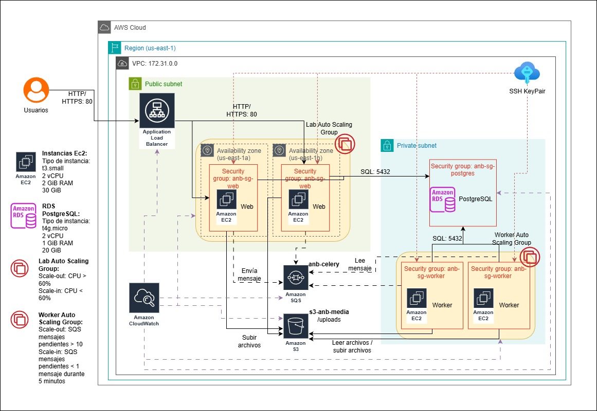

# Despliegue y Documentación

Este documento describe los servicios incorporados para la escalabilidad en la capa web y la capa worker, siguiendo los lineamientos de la *Entrega 4 - Escalabilidad en la capa batch/worker*.

Se presenta:
* Modelo de despliegue.
    * Flujo general.
    * Security groups.
    * Auto Scaling implementado.
* Explicación de las tecnologías y servicios incorporados.
* Cambios realizados con respecto a la entrega anterior.

---

## ☁️ Modelo de Despliegue

El nuevo modelo de despliegue está basado en una infraestructura modular dentro de una **VPC de AWS**, con subredes públicas y privadas.  
La **subred pública** aloja las instancias EC2 (API) y el **Application Load Balancer**, mientras que la **subred privada** contiene la base de datos RDS y las instancias EC2 (worker). 
El almacenamiento de archivos se realiza en **Amazon S3**, y **CloudWatch** supervisa todos los recursos para activar alarmas y escalar instancias de manera automática.
La mensajería entre los componentes se realiza por medio de la cola **Amazon SQS**.
Para el acceso a las intancias se hace por medio de **SSH KeyPair**, par de claves para acceso administrativo seguro (por SSH).

| Capa               | Ubicación             | Descripción                                                                                     |
| ------------------ | --------------------- | ----------------------------------------------------------------------------------------------- |
| **Web (API)**      | Subred pública        | Instancias EC2 dentro de un Auto Scaling Group detrás de un Application Load Balancer.          |
| **Worker batch**   | Subred privada        | Instancias EC2 aisladas del público, escalando según la cantidad de mensajes pendientes en SQS. |
| **Base de datos**  | Subred privada        | Instancia RDS PostgreSQL accesible únicamente desde los grupos de seguridad autorizados.        |
| **Mensajería**     | Servicio administrado | Amazon SQS como intermediario confiable entre Web y Worker.                                     |
| **Almacenamiento** | Servicio administrado | Amazon S3 para lectura y escritura de archivos de entrada y salida.                             |

### Flujo general

1. El usuario realiza una solicitud hacia la API.
2. El ALB distribuye la solicitud a una instancia del ASG Web.
3. La API:
    * Valida el archivo
    * Lo sube a S3
    * Publica un mensaje en SQS con metadatos del procesamiento
4. Un worker, dentro del ASG Worker:
    * Lee el mensaje desde SQS
    * Descarga el archivo desde S3
    * Procesa el video
    * Guarda resultados nuevamente en S3
    * Actualiza el estado en RDS
5. CloudWatch monitorea métricas de CPU (web) y mensajes pendientes (workers).
6. Las políticas del ASG ajustan automáticamente la cantidad de nodos web y worker.

### Security Groups

| SG                  | Permite                                                               | Restringe                  |
| ------------------- | --------------------------------------------------------------------- | -------------------------- |
| **anb-sg-web**      | Recibe tráfico HTTP/HTTPS desde Internet y envía tráfico al RDS y SQS | Todo tráfico no autorizado |
| **anb-sg-worker**   | Acceso a RDS, SQS, S3 endpoints                                       | No tráfico desde Internet  |
| **anb-sg-postgres** | Solo permite tráfico desde Web y Worker a 5432                        | No público                 |
| **SG del ALB**      | Recibe tráfico de usuarios, envía solo a Web                          |                            |

### Auto Scaling implementado

* **Lab Auto Scaling Group**
    * Zonas: us-east-1a y us-east-1b
    * Escalamiento:
        * scale-out: CPU > 60%
        * scale-in: CPU < 60%
    * Integrado con el **ALB**

* **Worker Auto Scaling Group**
    * Escalamiento basado en SQS:
        * scale-out: SQS > 10 mensajes pendientes
        * scale-in: SQS < 1 mensaje durante 5 min

---

## 🧩 Tecnologías y Servicios Incorporados

| Servicio                            | Descripción                                                                                                             |
| ----------------------------------- | ----------------------------------------------------------------------------------------------------------------------- |
| **EC2 (capa Web y capa Worker)**    | Ejecutan la API REST y los procesos batch de forma independiente. Workers están aislados en la subred privada.          |
| **Application Load Balancer (ALB)** | Distribuye tráfico HTTP/HTTPS entre las instancias del ASG Web.                                                         |
| **Auto Scaling Group Web**          | Escala según **CPU > 60%** / disminuye bajo **CPU < 60%**. Distribuido en 2 zonas de disponibilidad.                    |
| **Auto Scaling Group Worker**       | Escala según métricas de SQS:  • **Scale-out:** >10 mensajes pendientes  • **Scale-in:** <1 mensaje durante 5 min |
| **Amazon SQS**                      | Cola de procesamiento de tareas; la API publica los trabajos y los workers los consumen.                                |
| **Amazon RDS PostgreSQL**           | Base de datos centralizada disponible solo dentro de la VPC.                                                            |
| **Amazon S3**                       | Almacena los archivos subidos y los resultados procesados por los workers.                                              |
| **Amazon CloudWatch**               | Supervisa Web, Worker, SQS, ALB y RDS; activa alarmas y escalado automático.                                            |
| **Security Groups**                 | Definen comunicación estricta entre Web, Worker, RDS y ALB.                                                             |

---

## 🔩 Arquitectura Ajustada

La arquitectura fue modificada con respecto a la entrega #3 para poder responder a los requerimientos de escalabilidad, disponibilidad y eficiencia en la nube de AWS.

En la entrega se incorporan los servicios que permitan la ejecución automática de múltiples instancias batch/worker y el monitoreo en tiempo real de los recursos.

Los cambios realizados son:
* Se configura el **Auto Scaling Group (ASG)** para batch/worker.
* Se migra las colas de mensajería de **RabbitMQ** a **Amazon SQS**.
* Se integra **Amazon CloudWatch** para el monitoreo y activación de las políticas de escalado para la capa batch/worker.
* Se habilitan 2 zonas de disponibilidad para la capa web.

---

## 🔄 Cambios Principales Respecto a la Entrega 3

| Componente             | Entrega 3                            | Entrega 4                                              |
| ---------------------- | ------------------------------------ | ------------------------------------------------------ |
| **Worker**             | Instancia única sin autoescalamiento | Auto Scaling Group completo, aislado en subred privada |
| **SQS**                | No existía                           | Integrado como cola de procesamiento                   |
| **Escalado batch**     | No existía                           | Escalado automático basado en mensajes pendientes      |
| **Web**                | Solo escalamiento web                | Mantiene escalamiento web + integración con cola     |
| **Balanceador**        | Distribuye las cargas entre las instancias                | Distribuye las cargas entre las instancias + 2 zonas de disponibilidad de AWS     |
| **CloudWatch**         | Solo monitoreaba Web + RDS           | Monitorea Web, Worker, SQS y RDS                       |

