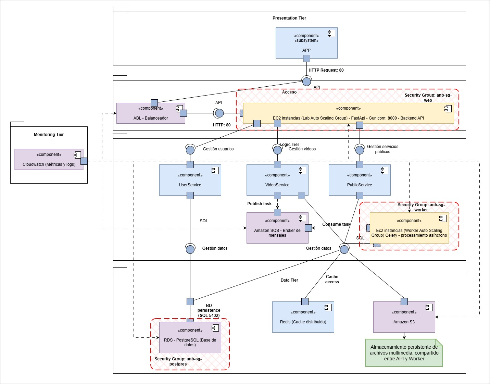

# Diagrama de componentes

# Application Layer (Lógica de la aplicación)

## API REST (EC2 ASG - FastAPI + Gunicorn)
* Servicio principal que expone los endpoints HTTP.
* Está detrás de un Application Load Balancer (ALB) en la subred pública.
* Se despliega mediante un Auto Scaling Group (Lab Auto Scaling Group) que ajusta el número de instancias según la carga.
* Interactúa con:
    * RDS PostgreSQL para operaciones SQL.
    * S3 para guardar o consultar los videos cargados o procesados.
    * Amazon SQS para publicar tareas asíncronas hacia los Workers.

## Amazon SQS (Broker de Mensajes)
* Reemplaza completamente a RabbitMQ.
* Cola administrada, escalable y sin mantenimiento.
* Flujo principal:
    * La API publica los videos a procesar en SQS (Publish).
    * Los Workers consumen los videos a procesar desde la misma cola (Consume).

## Worker (EC2 ASG – Celery / Procesamiento Asíncrono)
* Conjunto de instancias en un Auto Scaling Group independiente (Worker Auto Scaling Group).
* Solo accesibles dentro de la red privada.
* Procesa las tareas enviadas desde SQS.
* Interactúa con:
    * S3 (consulta de videos por procesar y almacenamiento de videos procesados).
    * RDS PostgreSQL para guardar resultados o actualizar estados.

## Amazon S3
* Servicio de almacenamiento de objetos.
* El api sube los videos a procesar.
* El Worker consulta los videos a procesar y guarda los videos procesados.
* La API REST puede consultar S3 a través de URLs firmadas o presignadas.

## Base de datos
* Almacena los datos de negocio o metadatos de las operaciones.
* El Worker y la API REST se comunican con ella mediante el ORM/Driver.
ORM / Driver
* Componente de software que conecta la lógica de aplicación (Python ORM, por ejemplo SQLAlchemy) con el motor de base de datos relacional (PostgreSQL).
