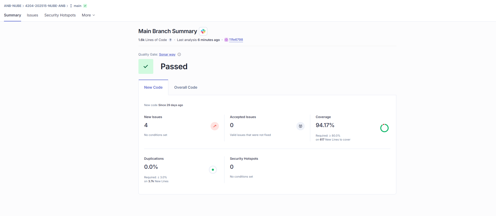

# Reporte de Sonar

**Entrega 4:**

[Sonarcloud](https://sonarcloud.io/summary/new_code?id=cfninor_4204-202515-NUBE-ANB&branch=main)

## 🔄 Cambios Principales Respecto a la Entrega 3

| **Métrica**                               | **Entrega 3** | **Entrega 4** | **Cambio / Observación**                         |
| ----------------------------------------- | -------------------- | ----------------- | ------------------------------------------------ |
| **Líneas de código**                      | 954 LOC              | 1.6k LOC          | 📈 Aumentó aprox. 67% por nuevas funcionalidades |
| **Quality Gate**                          | ✔️ Passed            | ✔️ Passed         | Ambas cumplen el Sonar Way                       |
| **Nuevos issues**                         | **0**                | **4**             | 🔴 Aparecen 4 issues nuevos, Los 4 nuevos incidentes fueron identificados en el código implementado para la ejecución del escenario 2, no sobre las funcionalidades principales solicitadas.                    |
| **Issues aceptados**                      | 0                    | 0                 | Sin cambios                                      |
| **Coverage (Cobertura tests)**            | **98.42%**           | **94.17%**        | 🔽 Reducción de ~4.25%, la cobertura sigue siendo muy alta |
| **Líneas nuevas a cubrir**                | 316                  | 617               | Más del doble de líneas nuevas introducidas      |
| **Duplicaciones**                         | 0.0%                 | 0.0%              | Sin duplicación en ninguna versión               |
| **Security Hotspots**                     | 0                    | 0                 | Sin riesgos señalados                            |
