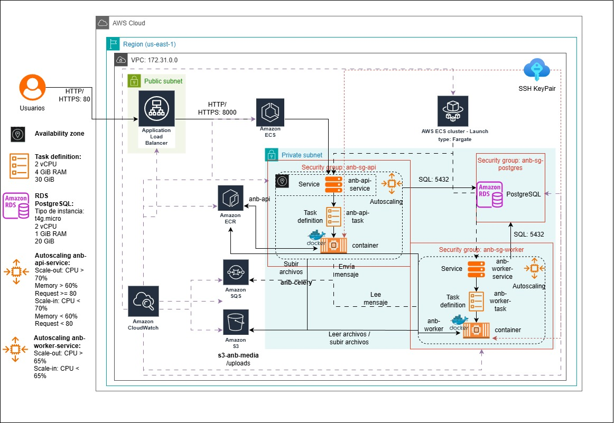

# Despliegue y Documentación

Este documento describe la arquitectura implementada para el despliegue de la aplicación en un entorno PaaS en AWS, presentando los servicios utilizados para la escalabilidad en la capa web (API) y la capa worker, siguiendo los lineamientos de la *Entrega 5 - Despliegue en PAAS*.

Se presenta:
* Modelo de despliegue.
    * Flujo general.
    * Security groups.
    * Auto Scaling implementado.
* Explicación de las tecnologías y servicios incorporados.
* Cambios realizados con respecto a la entrega anterior basada en EC2.

---

## ☁️ Modelo de Despliegue

La nueva arquitectura reemplaza por completo la ejecución basada en EC2 (Entrega 4). 

En esta nueva entrega se adopta un enfoque serverless/administrado utilizando *AWS Elastic Container Service (ECS) con Fargate*, donde la plataforma gestiona automaticamente la infraestructura de cómputo sin la necesidad de administrar instancias EC2.
* La aplicación se despliegue dentro de una VPC con subredes públicas y privadas:
    * La subred pública aloja el *Application Load Balancer (ALB)*
    * La subred privada aloja las tareas Fargate de los servicios *API y WORKER*, también se encuentra la instancia *RDS PostgreSQL*.
    * El almacenamiento de objetos se gestiona mediante *Amazon S3*.
    * El monitoreo y la activación de politícas de auto escalado se gestiona mediante *Amazon CloudWatch*.
    * La comunicación asíncrona entre los servicios API y WORKER se hace mediante *Amazon SQS*.

| Capa               | Ubicación             | Descripción                                                                                      |
| ------------------ | --------------------- | ------------------------------------------------------------------------------------------------ |
| **Web (API)**      | Subred privada        | Servicio ECS Fargate detrás de un ALB. Múltiples tareas con autoscaling basado en CPU y tráfico. |
| **Worker batch**   | Subred privada        | Servicio ECS Fargate que consume tareas desde SQS y escala automáticamente.                      |
| **Base de datos**  | Subred privada        | Instancia RDS PostgreSQL accesible únicamente desde los servicios autorizados.                   |
| **Mensajería**     | Servicio administrado | Amazon SQS como cola confiable de procesamiento.                                                 |
| **Almacenamiento** | Servicio administrado | Amazon S3 para guardar los videos originales y procesados.                                       |

### Flujo general

1. El usuario realiza una solicitud hacia la API.
2. El Application Load Balancer enruta la petición al servicio ECS “anb-api-service”.
3. La API:
    * Valida el archivo
    * Lo sube a S3
    * Publica un mensaje en SQS con metadatos del procesamiento
4. El servicio ECS “anb-worker-service” (workers):
    * Lee el mensaje desde SQS
    * Descarga el archivo desde S3
    * Procesa el video
    * Guarda resultados nuevamente en S3
    * Actualiza el estado en RDS
5. CloudWatch monitorea métricas de CPU (web) y mensajes pendientes (workers).
6. Las políticas de escalamiento ajustan automáticamente la cantidad de tareas Fargate para API y Worker.

### Security Groups

| SG      | Permite                                                                      | Restringe                              |
| ------------------- | ---------------------------------------------------------------------------- | -------------------------------------- |
| **anb-sg-api**      | Tráfico desde el ALB hacia el servicio API. Acceso saliente a SQS, S3 y RDS. | Acceso público directo a la API.       |
| **anb-sg-worker**   | Acceso a SQS, S3 y RDS.                                                      | Tráfico entrante desde Internet.       |
| **anb-sg-postgres** | Conexiones entrantes únicamente desde API y Worker en el puerto 5432.        | Todo acceso no autorizado.             |
| **SG del ALB**      | Recibe peticiones HTTP/HTTPS desde Internet y las envía al API Service.      | No permite conexiones entre instancias |

### Auto Scaling implementado

* **Auto Scaling del API Service (ECS Fargate)**
    * Escalamiento:
        * scale-out: 
            * CPU > 70%
            * Memory > 60%
            * Request >= 80
        * scale-in:
            * CPU < 70%
            * Memory < 60%
            * Request < 80

* **Auto Scaling del Worker Service (ECS Fargate)**
    * Escalamiento:
        * scale-out: CPU >65%
        * scale-in: CPU < 65%

---

## 🧩 Tecnologías y Servicios Incorporados

| Servicio                             | Descripción                                                                                                        |
| ------------------------------------ | ------------------------------------------------------------------------------------------------------------------ |
| **Amazon ECS (Fargate)**             | Orquesta contenedores sin necesidad de administrar servidores. Ejecuta API y Workers como servicios autoscalables. |
| **ECR (Elastic Container Registry)** | Almacena las imágenes Docker de la API y del Worker.                                                               |
| **Application Load Balancer (ALB)**  | Distribuye tráfico entrante hacia las tareas del servicio API.                                                     |
| **ECS Service – API**                | Expone la API REST en contenedores Fargate habilitados para escalabilidad horizontal.                              |
| **ECS Service – Worker**             | Procesa mensajes desde SQS en contenedores Fargate dedicados. Escala según la carga de la cola.                    |
| **Amazon SQS**                       | Cola de mensajes usada para la coordinación entre API y Worker.                                                    |
| **Amazon RDS PostgreSQL**            | Base de datos central usada para almacenar estados y metadatos del procesamiento.                                  |
| **Amazon S3**                        | Almacén de objetos para videos originales y procesados.                                                            |
| **Amazon CloudWatch**                | Recolecta métricas de ECS, ALB, SQS, RDS y ejecuta las políticas de escalado.                                      |
| **Security Groups**                  | Aíslan y protegen la comunicación entre API, Worker y RDS.                                                         |

---

## 🔩 Arquitectura Ajustada

La arquitectura fue rediseñada respecto a la entrega anterior para poder adoptar un modelo *PaaS totalmente administrado*, eliminando la dependencia de EC2 y migrando toda la aplicación hacia contenedores administrados bajo Fargate.

Los principales cambios realizados son:
* Migración completa del despliegue a **ECS Fargate**, eliminando la necesidad de administrar servidores EC2.
* Separación clara de servicios:
    * **anb-api-service**
    * **anb-worker-service**
* Integración del ALB con el servicio API para distribución del tráfico.
* Autoscaling nativo sobre servicios ECS, sin ASG.

---

## 🔄 Cambios Principales Respecto a la Entrega 4

| Componente          | Entrega 3 (EC2)       | Nueva entrega (ECS + Fargate)                                          |
| ------------------- | ---------------------------- | ---------------------------------------------------------------------- |
| **Capa Web**        | ASG de EC2 detrás de un ALB  | Servicio ECS autoscalable administrado con Fargate                     |
| **Workers**         | EC2 en ASG privado           | Servicio ECS Worker escalado por SQS                                   |
| **Escalado API**    | Basado en uso de CPU del ASG | Basado en CPU, Memoria y Request                                       |
| **Escalado WORKER** | Basado en cantidad de mensajes | Basado en CPU                                     |
| **Infraestructura** | EC2 administrado manualmente | Fargate administra la infraestructura sin servidores                   |
| **Monitoreo**       | Monitorea Web, Worker, SQS y RDS            | CloudWatch integrado a ECS, ALB, SQS y RDS              |
| **Disponibilidad**  | Alta disponibilidad en EC2   | Alta disponibilidad garantizada por ECS distribuyendo tareas entre AZs |

