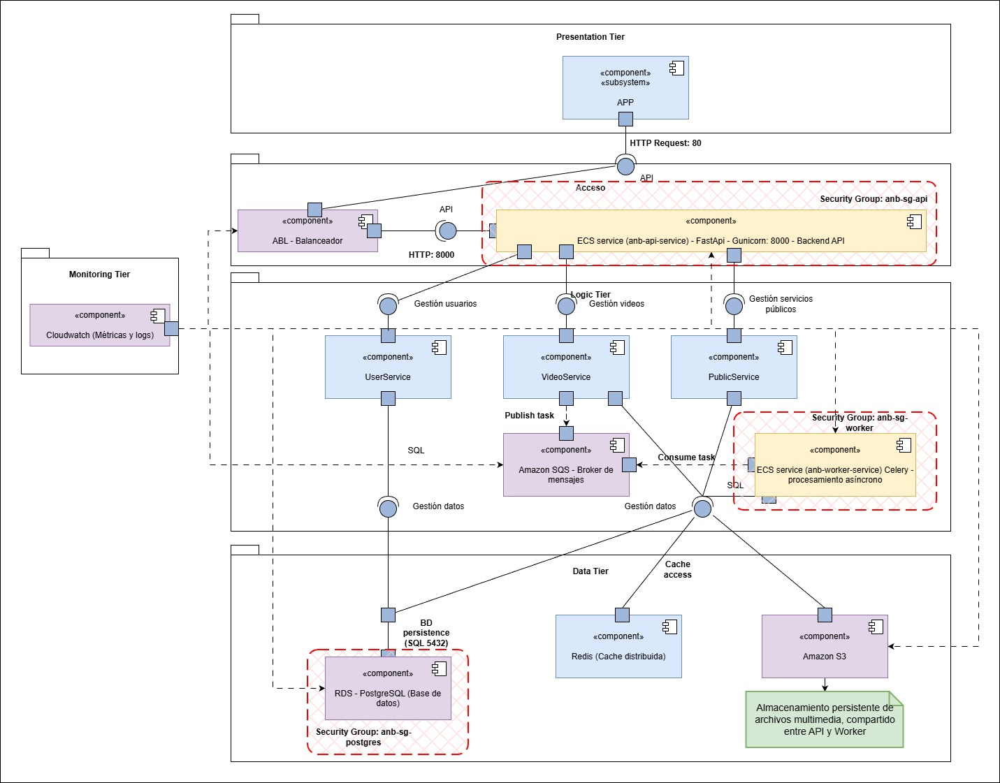

# Diagrama de componentes

# Presentation tier

## APP (Cliente externo)
* Corresponde al consumidor externo que realiza solicitudes HTTP/HTTPS al sistema.
* Solo interactúa con el Application Load Balancer (ALB).
* No interactúa directamente con la API ni con los servicios internos.

# API Layer (ECS – Capa Web)

## Application Load Balancer (ALB)
* Expuesto en la subred pública.
* Recibe todas las solicitudes HTTP/80 desde el cliente.
* Reenvía las solicitudes al ECS Service (anb-api-service) a través de su target group.
* Usa health checks para verificar si una instancia sigue activa (ej. /health).
* Está asociado al Security Group anb-sg-api-lb, que permite tráfico entrante desde internet y solo envía tráfico a la API en la capa privada.

## API REST – ECS Service (anb-api-service) – FastAPI + Gunicorn
* Servicio principal que expone los endpoints HTTP.
* Servicio desplegado en AWS ECS Fargate, sin necesidad de administrar servidores.
* Ejecuta contenedores definidos en anb-api-task.
* Corre en subred privada, exponiendo el puerto interno (8000) al target group del ALB.
* Escala automáticamente mediante políticas de ECS Auto Scaling basadas en:
    * CPU (> 70%)
    * Memoria (> 60%)
    * Request (>=80)
* Interactúa con:
    * RDS PostgreSQL para operaciones SQL.
    * S3 para guardar o consultar los videos cargados o procesados.
    * Amazon SQS para publicar tareas asíncronas hacia los Workers.
* Está protegido por el Security Group anb-sg-api, que restringe accesos externos y solo permite tráfico desde el ALB.

# Application Layer (Lógica de la aplicación)

## UserService (Gestión de usuarios)
* Implementa la lógica para manejo de usuarios y sesiones.

## VideoService (Gestión de videos)
* Procesa solicitudes relacionadas con archivos multimedia.
* Publica tareas pesadas hacia Amazon SQS (procesamiento de video).
* También consulta metadatos en la base de datos RDS.

## PublicService (Servicios públicos)
* Muestra los servicios que no requieren autorización.

## Amazon SQS (Broker de Mensajes)
* Reemplaza completamente a RabbitMQ.
* Cola administrada, escalable y sin mantenimiento.
* Flujo principal:
    * La API publica los videos a procesar en SQS (Publish).
    * Los Workers consumen los videos a procesar desde la misma cola (Consume).

## Worker – ECS Service (anb-worker-service) – Celery / Procesamiento
* Servicio ejecutado también en AWS ECS Fargate, aislado en la subred privada.
* No recibe tráfico público ni está detrás del ALB.
* Solo accesibles dentro de la red privada.
* Procesa las tareas enviadas desde SQS.
* Interactúa con:
    * S3 (consulta de videos por procesar y almacenamiento de videos procesados).
    * RDS PostgreSQL para guardar resultados o actualizar estados.
* Escala automáticamente mediante políticas de ECS Auto Scaling basadas en:
    * CPU (> 65%)

# Data tier (capa de datos y almacenamiento)

## Amazon S3
* Servicio de almacenamiento de objetos.
* El api sube los videos a procesar.
* El Worker consulta los videos a procesar y guarda los videos procesados.
* La API REST puede consultar S3 a través de URLs firmadas o presignadas.

## Base de datos
* Almacena los datos de negocio o metadatos de las operaciones.
* El Worker y la API REST se comunican con ella mediante el ORM/Driver.
ORM / Driver
* Componente de software que conecta la lógica de aplicación (Python ORM, por ejemplo SQLAlchemy) con el motor de base de datos relacional (PostgreSQL).

## Redis (Cache distribuida)
* Proporciona almacenamiento temporal y cacheo rápido.
* Se usa dentro de los servicios públicos para devolver resultados de manera más eficiente.

# Monitoring tier (monitoreo, logs y métricas)

## Amazon CloudWatch
* Es el servicio de observabilidad principal.
* Supervisa en general a todos los componentes presentados.
* Alarmas para el escalamiento automático:
    * API (uso de CPU, memoria y request)
    * SQS (Uso de CPU)
* Supervisa:
    * ECS Services (CPU, memoria, tareas en ejecución)
    * SQS (mensajes pendientes)
    * ALB (tráfico, errores, latencia)
    * RDS (conexiones, IOPS)

# Security Groups

## anb-sg-api
* Acepta tráfico HTTP del ALB.
* Permite salida a:
    * S3
    * SQS
    * RDS
* No permite acceso directo desde internet.

## anb-sg-worker
* Permite conexión hacia:
    * SQS
    * S3
    * RDS
* No acepta tráfico entrante externo.

## anb-sg-postgres
* Solo permite acceso al puerto 5432 desde:
    * anb-sg-api
    * anb-sg-worker
* No permite ninguna conexión desde internet.