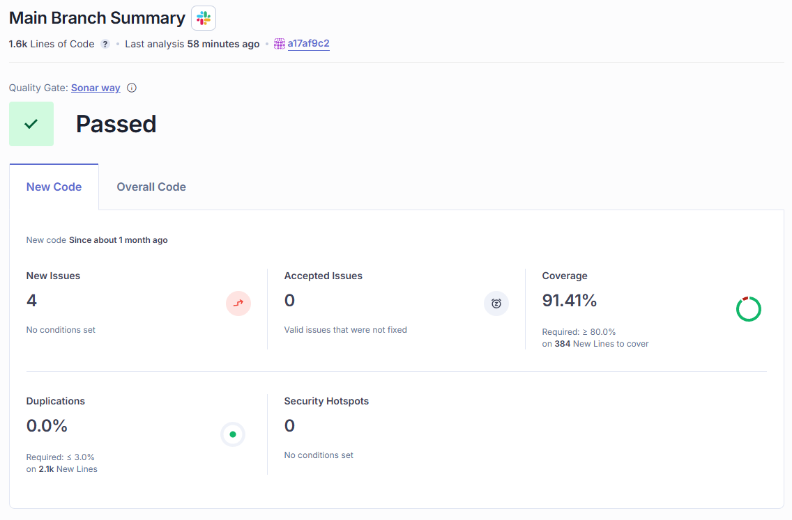

# Reporte de Sonar

**Entrega 5:**

[Sonarcloud](https://sonarcloud.io/summary/new_code?id=cfninor_4204-202515-NUBE-ANB&branch=main)

## 🔄 Cambios Principales Respecto a la Entrega 4

| **Métrica**                       | **Entrega 4** | **Entrega 5** | **Cambio / Observación**                                                    |
| --------------------------------- | ------------- | ------------- | --------------------------------------------------------------------------- |
| **Líneas de código (LOC)**        | 1.6k LOC      | 1.6k LOC      | ➖ Se mantiene igual, sin incremento significativo                           |
| **Quality Gate**                  | ✔️ Passed     | ✔️ Passed     | Ambas cumplen el *Sonar Way* sin degradación                                |
| **Nuevos issues**                 | 4             | 4             | ➖ Igual. No aparecieron nuevos issues en la entrega 5, recordar que los 4 incidentes fueron identificados en el código implementado para la ejecución del escenario 2, no sobre las funcionalidades principales solicitadas.                       |
| **Issues aceptados**              | 0             | 0             | Sin cambios                                                                 |
| **Coverage (Cobertura de tests)** | **94.17%**    | **91.41%**    | 🔽 Baja de 2.76%. La nueva lógica aumentó líneas sin test asociado aún      |
| **Líneas nuevas a cubrir**        | 617           | 384           | 🔽 Disminuye un 37.8%. La entrega 5 introduce menos código nuevo que cubrir |
| **Duplicaciones**                 | 0.0%          | 0.0%          | Sin duplicaciones en ninguna versión                                        |
| **Security Hotspots**             | 0             | 0             | Sin riesgos detectados                                                      |